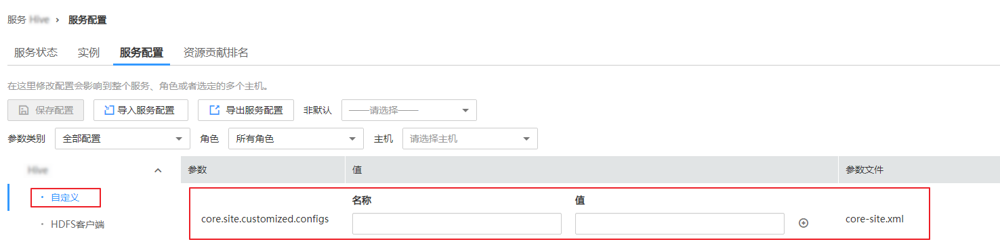
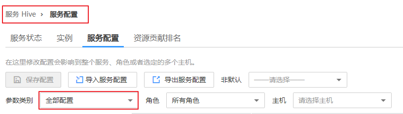
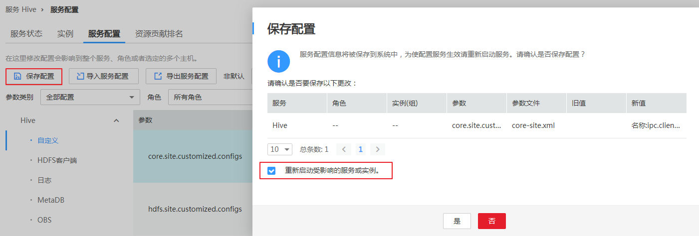

# 配置服务自定义参数

MRS各个组件支持开源的所有参数，在MRS Manager支持修改部分关键使用场景的参数，且部分组件的客户端可能不包含开源特性的所有参数。如果需要修改其他Manager未直接支持的组件参数，用户可以在Manager通过自定义配置项功能为组件添加新参数。添加的新参数最终将保存在组件的配置文件中并在重启后生效。

## 对系统的影响

-   配置服务属性后，需要重启此服务，重启期间无法访问服务。
-   配置HBase、HDFS、Hive、Spark、Yarn、Mapreduce服务属性后，需要重新下载并更新客户端配置文件。

## 前提条件

用户已充分了解需要新添加的参数意义、生效的配置文件以及对组件的影响。

## 操作步骤

1.  在MRS Manager界面，单击“服务管理”。
2.  单击服务列表中指定的服务名称。
3.  单击“服务配置”。
4.  在“参数类别”选择“全部配置”。

    **图 1**  服务全部配置  
    

5.  在左侧导航栏选择“自定义”，Manager将显示当前组件的自定义参数。

    “参数文件”显示保存用户新添加的自定义参数的配置文件。每个配置文件中可能支持相同名称的开源参数，设置不同参数值后生效结果由组件加载配置文件的顺序决定。自定义参数支持服务级别与角色级别，请根据业务实际需要选择。不支持单个角色实例添加自定义参数。

    **图 2**  服务自定义配置  
    

6.  根据配置文件与参数作用，在对应参数项所在行“名称”列输入组件支持的参数名，在“值”列输入此参数的参数值。
    -   支持单击和增加或删除一条自定义参数。第一次单击添加自定义参数后才支持删除操作。
    -   修改某个参数的值后需要取消修改，可以单击恢复。

7.  单击“保存配置”，勾选“重新启动受影响的服务或实例。”并单击“确定”重启服务。

    界面提示“操作成功。”，单击“完成”，服务成功启动。

## 任务示例

**配置Hive自定义参数**

Hive依赖于HDFS，默认情况下Hive访问HDFS时是HDFS的客户端，生效的配置参数统一由HDFS控制。例如HDFS参数“ipc.client.rpc.timeout”影响所有客户端连接HDFS服务端的RPC超时时间，如果用户需要单独修改Hive连接HDFS的超时时间，可以使用自定义配置项功能进行设置。在Hive的“core-site.xml”文件增加此参数可被Hive服务识别并代替HDFS的设置。

1.  在MRS Manager界面，选择 “服务管理 \> Hive \> 服务配置”。
2.  在“参数类别”选择“全部配置”。

    **图 3**  Hive服务配置  
    

3.  在左侧导航栏选择Hive服务级别“自定义”，Manager将显示Hive支持的服务级别自定义参数。
4.  在“core-site.xml”对应参数“core.site.customized.configs”的“名称：”输入“ipc.client.rpc.timeout”，“值：”输入新的参数值，例如“150000”。单位为毫秒。

    **图 4**  Hive自定义参数配置  
    

5.  单击“保存配置”，勾选“重新启动受影响的服务或实例。”并单击“是”重启服务。

    界面提示“操作成功。”，单击“完成”，服务成功启动。

    **图 5**  保存Hive参数配置  
    

