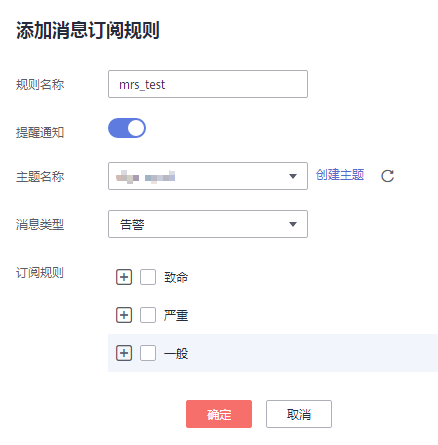

# 配置消息通知

MRS联合消息通知服务\(SMN\)，采用主题订阅模型，提供一对多的消息订阅以及通知功能，能够实现一站式集成多种推送通知方式（短信和邮件通知）。

## 操作场景

在MRS管理控制台，按照集群维度，在集群信息页面的告警页签中能够提供选择是否使能通知服务，只有对应集群开关开启以后，才能实现以下场景的功能：

-   在用户订阅了通知服务之后，当集群出现扩容成功/失败、缩容成功/失败、删除成功/失败、弹性升缩成功/失败的场景下，由MRS管理面通过邮件或短信方式通知对应用户。
-   管理面检查大数据集群的告警信息，如果大数据集群的告警信息影响到服务的使用，其告警级别达到致命时，则发送信息通知给对应租户。
-   在用户集群的ECS机器被删除、关机、修改规格、重启、更新OS的行为，会导致大数据集群异常，当检测到用户的虚拟机出现以上状态的时候，发送通知给对应用户。

## 创建主题

主题是消息发布或客户端订阅通知的特定事件类型。它作为发送消息和订阅通知的信道，为发布者和订阅者提供一个可以相互交流的通道。

1.  登录管理控制台。
2.  选择“应用服务 \> 消息通知服务”。

    进入消息通知服务页面。

3.  在左侧导航栏，选择“主题管理 \> 主题”。

    进入主题页面。

4.  在主题页面，单击“创建主题”，开始创建主题。

    此时将显示“创建主题”对话框。

5.  在“主题名称”框中，输入主题名称，在“显示名”框中输入相关描述。

## 向主题添加订阅

要接收发布至主题的消息，您必须添加一个订阅终端节点到该主题。消息通知服务会发送一条订阅确认的消息到订阅终端，订阅确认的消息将在48小时内有效。如果订阅者在48小时之内确认订阅，将会收到推送至主题的消息。如果订阅者在48小时之内没有确认订阅，则需要再次给订阅者发送订阅确认的消息。

1.  登录管理控制台。
2.  选择“应用服务 \> 消息通知服务”。

    进入消息通知服务页面。

3.  在左侧导航栏，选择“主题管理 \> 主题”。

    进入主题页面。

4.  在主题列表中，选择您要向其添加订阅者的主题，在右侧“操作”栏单击“添加订阅”。

    此时将显示“添加订阅”对话框。

    其中：协议参数选项为“短信”、“邮件”、“HTTP”、“HTTPS”、FunctionGraph（函数）、FunctionGraph（工作流）以及DMS。

    订阅终端参数为订阅的终端地址，短信、邮件、HTTP以及HTTPS终端支持批量输入，批量添加时，每个终端地址占一行。最多可输入10个终端。

1.  单击“确定”。

新增订阅将显示在页面下方的订阅列表中。

## 向订阅者发送消息

1.  登录MRS管理控制台。
2.  选择“集群列表 \> 现有集群“，选中一个运行中的集群并单击集群名称，进入集群信息页面。
3.  单击“告警管理“页签。
4.  选择“消息订阅 \> 添加消息订阅”，进入添加消息订阅页面。
5.  配置消息订阅相关参数。

    **表 1**  消息订阅参数说明

    
    <table><thead align="left"><tr id="row14744124125013"><th class="cellrowborder" valign="top" width="50%" id="mcps1.2.3.1.1">
参数

    </th>
    <th class="cellrowborder" valign="top" width="50%" id="mcps1.2.3.1.2">
说明

    </th>
    </tr>
    </thead>
    <tbody><tr id="row6744162419509"><td class="cellrowborder" valign="top" width="50%" headers="mcps1.2.3.1.1 ">
规则名称

    </td>
    <td class="cellrowborder" valign="top" width="50%" headers="mcps1.2.3.1.2 ">
用户自定义发送订阅消息的规则名称，只能包含数字、英文字符、中划线和下划线。

    </td>
    </tr>
    <tr id="row674516249506"><td class="cellrowborder" valign="top" width="50%" headers="mcps1.2.3.1.1 ">
提醒通知

    </td>
    <td class="cellrowborder" valign="top" width="50%" headers="mcps1.2.3.1.2 "><ul id="ul274522415501"><li>选择开启时，将按照该订阅规则为订阅者发送对应订阅消息。</li><li>选择关闭时，该规则不会生效，即不会向订阅者发送订阅消息。</li></ul>
    </td>
    </tr>
    <tr id="row074582465011"><td class="cellrowborder" valign="top" width="50%" headers="mcps1.2.3.1.1 ">
选择主题

    </td>
    <td class="cellrowborder" valign="top" width="50%" headers="mcps1.2.3.1.2 ">
选择已创建的主题，也可以单击“创建主题”重新创建。

    </td>
    </tr>
    <tr id="row13745102414504"><td class="cellrowborder" valign="top" width="50%" headers="mcps1.2.3.1.1 ">
消息类型

    </td>
    <td class="cellrowborder" valign="top" width="50%" headers="mcps1.2.3.1.2 ">
选择需要订阅的消息类型。

    <ul id="ul1174592410506"><li>告警</li><li>事件</li></ul>
    </td>
    </tr>
    <tr id="row87451524185016"><td class="cellrowborder" valign="top" width="50%" headers="mcps1.2.3.1.1 ">
订阅规则

    </td>
    <td class="cellrowborder" valign="top" width="50%" headers="mcps1.2.3.1.2 ">
选择需要订阅的消息规则，可根据需要勾选全部或部分规则。

    <ul id="ul1274552411509"><li>致命</li><li>严重</li><li>一般</li><li>提示</li></ul>
    </td>
    </tr>
    </tbody>
    </table>

    **图 1**  配置消息提醒  
    

6.  单击“确定“完成消息提醒配置。

