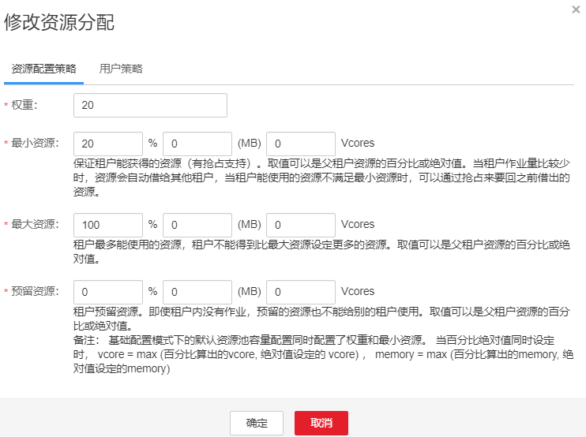
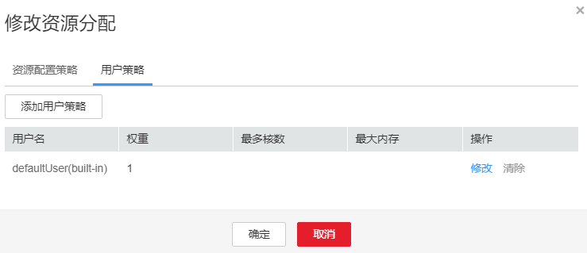
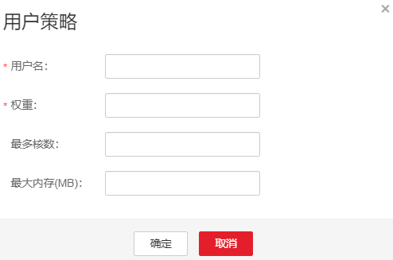

# 配置资源池的队列容量策略

## 操作场景

添加资源池后，需要为Yarn任务队列配置在此资源池中可使用资源的容量策略，队列中的任务才可以正常在这个资源池中执行。

该任务指导系统管理员通过FusionInsight Manager配置队列策略。使用Superior调度器的租户队列，可以配置使用不同资源池的资源。

## 前提条件

-   已登录FusionInsight Manager。

-   已添加资源池。
-   任务队列不与其他队列相关联资源池，除了默认资源池。

## 操作步骤

1.  在FusionInsight Manager，单击“租户资源”。
2.  单击“动态资源计划”页签。
3.  单击“资源分布策略”页签。
4.  “集群”参数选择待操作的集群名称，然后在“资源池”选择指定的资源池。
5.  在“资源分配”列表指定队列的“操作”列，单击“修改”。
6.  在“修改资源分配”窗口的“资源配置策略”页签设置任务队列在此资源池中的资源配置策略。

    **图 1**  资源配置策略  
    

    -   “权重“：表示租户能获得的资源。其初始值与最小资源百分比值一致。
    -   “最小资源“：表示租户能获得的最少资源。
    -   “最大资源“：表示租户能获得的最多资源。
    -   “预留资源“：表示保留给租户自身队列，且不能借用给其他租户队列的资源。

7.  在“修改资源分配”窗口的“用户策略”页签设置用户策略。

    **图 2**  用户策略  
    

    > **说明：** 
    >defaultUser\(built-in\)表示如果一个用户未配置策略，则默认使用defaultUser所指定的策略。该策略不可删除。

    -   单击“添加用户策略”添加用户策略。

        **图 3**  添加用户策略  
        

        -   “用户名“：表示用户的名称。
        -   “权重“：表示用户能获得的资源。
        -   “最多核数“：表示用户最多可以使用的虚拟核数。
        -   “最大内存“：表示用户最大可以使用的内存。

    -   单击“操作”列的“修改”修改现有用户策略。
    -   单击“操作”列的“删除”删除现有用户策略。

8.  单击“确定”保存配置。

