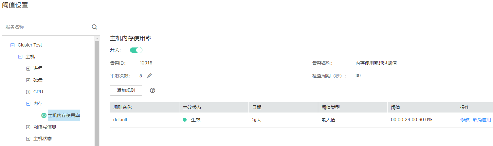

# 配置阈值

## 操作场景

FusionInsight Manager支持配置监控指标阈值用于关注各指标的健康情况，如果出现异常的数据并满足预设条件后，系统将会触发一条告警信息，并在告警页面中出现此告警信息。

## 操作步骤

1.  登录FusionInsight Manager。
2.  选择“运维  \>  告警  \>  阈值设置“。
3.  在监控分类中选择集群内指定主机或服务的监控指标。

    **图 1**  配置指标阈值  
    

    例如“主机内存使用率”，界面显示此阈值的信息：

    -   发送告警开关指示为表示将触发告警。
    -   “告警ID“和“告警名称“包含阈值将触发的告警信息。
    -   Manager会检查监控指标数值是否满足阈值条件，若连续检查且不满足的次数等于“平滑次数”设置的值则发送告警，支持自定义。
    -   “检查周期（秒）”表示Manager检查监控指标的时间间隔。
    -   规则列表中的条目为触发告警的规则。

4.  单击“添加规则”，可以新增指标的监控行为。

    **表 1**  监控指标规则参数

    
    <table><thead align="left"><tr id="zh-cn_topic_0263899330_row12963849"><th class="cellrowborder" valign="top" width="33.33333333333333%" id="mcps1.2.4.1.1">
参数名

    </th>
    <th class="cellrowborder" valign="top" width="33.33333333333333%" id="mcps1.2.4.1.2">
参数值

    </th>
    <th class="cellrowborder" valign="top" width="33.33333333333333%" id="mcps1.2.4.1.3">
参数解释

    </th>
    </tr>
    </thead>
    <tbody><tr id="zh-cn_topic_0263899330_row63285659"><td class="cellrowborder" valign="top" width="33.33333333333333%" headers="mcps1.2.4.1.1 ">
规则名称

    </td>
    <td class="cellrowborder" valign="top" width="33.33333333333333%" headers="mcps1.2.4.1.2 ">
CPU_MAX（举例）

    </td>
    <td class="cellrowborder" valign="top" width="33.33333333333333%" headers="mcps1.2.4.1.3 ">
规则名称

    </td>
    </tr>
    <tr id="zh-cn_topic_0263899330_row1867673853115"><td class="cellrowborder" valign="top" width="33.33333333333333%" headers="mcps1.2.4.1.1 ">
告警级别

    </td>
    <td class="cellrowborder" valign="top" width="33.33333333333333%" headers="mcps1.2.4.1.2 "><ul id="zh-cn_topic_0263899330_ul1489154513313"><li>紧急</li><li>重要</li><li>次要</li><li>提示</li></ul>
    </td>
    <td class="cellrowborder" valign="top" width="33.33333333333333%" headers="mcps1.2.4.1.3 ">
告警级别

    <ul id="zh-cn_topic_0263899330_ul1442985310344"><li>紧急</li><li>重要</li><li>次要</li><li>提示</li></ul>
    </td>
    </tr>
    <tr id="zh-cn_topic_0263899330_row1063345923310"><td class="cellrowborder" valign="top" width="33.33333333333333%" headers="mcps1.2.4.1.1 ">
阈值类型

    </td>
    <td class="cellrowborder" valign="top" width="33.33333333333333%" headers="mcps1.2.4.1.2 "><ul id="zh-cn_topic_0263899330_ul11927102183416"><li>最大值</li><li>最小值</li></ul>
    </td>
    <td class="cellrowborder" valign="top" width="33.33333333333333%" headers="mcps1.2.4.1.3 ">
选择某指标的最大值或最小值，类型为“最大值”表示指标的实际值大于设置的阈值时系统将产生告警，类型为“最小值”表示指标的实际值小于设置的阈值时系统将产生告警。

    </td>
    </tr>
    <tr id="zh-cn_topic_0263899330_row26447764"><td class="cellrowborder" valign="top" width="33.33333333333333%" headers="mcps1.2.4.1.1 ">
日期

    </td>
    <td class="cellrowborder" valign="top" width="33.33333333333333%" headers="mcps1.2.4.1.2 "><ul id="zh-cn_topic_0263899330_ul14830633173213"><li>每天</li><li>每周</li><li>其他</li></ul>
    </td>
    <td class="cellrowborder" valign="top" width="33.33333333333333%" headers="mcps1.2.4.1.3 ">
设置规则生效的日期，即哪一天运行规则。

    </td>
    </tr>
    <tr id="zh-cn_topic_0263899330_row30685210"><td class="cellrowborder" valign="top" width="33.33333333333333%" headers="mcps1.2.4.1.1 ">
添加日期

    </td>
    <td class="cellrowborder" valign="top" width="33.33333333333333%" headers="mcps1.2.4.1.2 ">
09-30

    </td>
    <td class="cellrowborder" valign="top" width="33.33333333333333%" headers="mcps1.2.4.1.3 ">
仅在“日期”模式为“其他”时可见，设置规则运行的自定义日期，支持多选。

    </td>
    </tr>
    <tr id="zh-cn_topic_0263899330_row64564030"><td class="cellrowborder" rowspan="2" valign="top" width="33.33333333333333%" headers="mcps1.2.4.1.1 ">
阈值设置

    </td>
    <td class="cellrowborder" valign="top" width="33.33333333333333%" headers="mcps1.2.4.1.2 ">
起止时间：00:00-8:30

    </td>
    <td class="cellrowborder" valign="top" width="33.33333333333333%" headers="mcps1.2.4.1.3 ">
设置规则运行的具体时间范围。

    </td>
    </tr>
    <tr id="zh-cn_topic_0263899330_row9355671"><td class="cellrowborder" valign="top" headers="mcps1.2.4.1.1 ">
阈值：10

    </td>
    <td class="cellrowborder" valign="top" headers="mcps1.2.4.1.2 ">
设置规则监控指标的阈值

    </td>
    </tr>
    </tbody>
    </table>

    > **说明：** 
    >支持单击或设置多个阈值时间条件。

5.  单击“确定”保存规则。
6.  在新添加规则所在的行，单击“操作”中的“应用”，此时规则的“生效状态”变成“生效”。

    当前已创建的规则单击“取消应用”后，才能应用新规则。

## 监控指标参考

FusionInsight Manager转告警监控指标可分为节点信息指标与集群服务指标。[表2](#zh-cn_topic_0263899330_table4447741)表示节点中可配置阈值的指标。

**表 2**  节点信息监控指标转告警列表

<table><thead align="left"><tr id="zh-cn_topic_0263899330_row3461745"><th class="cellrowborder" valign="top" width="25%" id="mcps1.2.5.1.1">
监控指标组名称

</th>
<th class="cellrowborder" valign="top" width="25%" id="mcps1.2.5.1.2">
监控指标名称

</th>
<th class="cellrowborder" valign="top" width="25%" id="mcps1.2.5.1.3">
指标含义

</th>
<th class="cellrowborder" valign="top" width="25%" id="mcps1.2.5.1.4">
默认阈值

</th>
</tr>
</thead>
<tbody><tr id="zh-cn_topic_0263899330_row50078068"><td class="cellrowborder" valign="top" width="25%" headers="mcps1.2.5.1.1 ">
CPU

</td>
<td class="cellrowborder" valign="top" width="25%" headers="mcps1.2.5.1.2 ">
主机CPU使用率

</td>
<td class="cellrowborder" valign="top" width="25%" headers="mcps1.2.5.1.3 ">
描述周期内当前集群的运算和控制能力，可通过观察该统计值，了解集群整体资源的使用情况。

</td>
<td class="cellrowborder" valign="top" width="25%" headers="mcps1.2.5.1.4 ">
90.0%

</td>
</tr>
<tr id="zh-cn_topic_0263899330_row373531"><td class="cellrowborder" rowspan="2" valign="top" width="25%" headers="mcps1.2.5.1.1 ">
磁盘

</td>
<td class="cellrowborder" valign="top" width="25%" headers="mcps1.2.5.1.2 ">
磁盘使用率

</td>
<td class="cellrowborder" valign="top" width="25%" headers="mcps1.2.5.1.3 ">
描述主机磁盘的使用率。

</td>
<td class="cellrowborder" valign="top" width="25%" headers="mcps1.2.5.1.4 ">
90.0%

</td>
</tr>
<tr id="zh-cn_topic_0263899330_row355858"><td class="cellrowborder" valign="top" headers="mcps1.2.5.1.1 ">
磁盘inode使用率

</td>
<td class="cellrowborder" valign="top" headers="mcps1.2.5.1.2 ">
统计采集周期内磁盘inode使用率。

</td>
<td class="cellrowborder" valign="top" headers="mcps1.2.5.1.3 ">
80.0%

</td>
</tr>
<tr id="zh-cn_topic_0263899330_row28203202"><td class="cellrowborder" valign="top" width="25%" headers="mcps1.2.5.1.1 ">
内存

</td>
<td class="cellrowborder" valign="top" width="25%" headers="mcps1.2.5.1.2 ">
主机内存使用率

</td>
<td class="cellrowborder" valign="top" width="25%" headers="mcps1.2.5.1.3 ">
统计当前时间点的内存平均使用率。

</td>
<td class="cellrowborder" valign="top" width="25%" headers="mcps1.2.5.1.4 ">
90.0%

</td>
</tr>
<tr id="zh-cn_topic_0263899330_row19905440"><td class="cellrowborder" rowspan="2" valign="top" width="25%" headers="mcps1.2.5.1.1 ">
主机状态

</td>
<td class="cellrowborder" valign="top" width="25%" headers="mcps1.2.5.1.2 ">
主机文件句柄使用率

</td>
<td class="cellrowborder" valign="top" width="25%" headers="mcps1.2.5.1.3 ">
统计采集周期内该主机的文件句柄使用率。

</td>
<td class="cellrowborder" valign="top" width="25%" headers="mcps1.2.5.1.4 ">
80.0%

</td>
</tr>
<tr id="zh-cn_topic_0263899330_row57872870"><td class="cellrowborder" valign="top" headers="mcps1.2.5.1.1 ">
主机PID使用率

</td>
<td class="cellrowborder" valign="top" headers="mcps1.2.5.1.2 ">
主机PID使用率。

</td>
<td class="cellrowborder" valign="top" headers="mcps1.2.5.1.3 ">
90%

</td>
</tr>
<tr id="zh-cn_topic_0263899330_row58054142"><td class="cellrowborder" valign="top" width="25%" headers="mcps1.2.5.1.1 ">
网络状态

</td>
<td class="cellrowborder" valign="top" width="25%" headers="mcps1.2.5.1.2 ">
TCP临时端口使用率

</td>
<td class="cellrowborder" valign="top" width="25%" headers="mcps1.2.5.1.3 ">
统计采集周期内该主机的TCP临时端口使用率。

</td>
<td class="cellrowborder" valign="top" width="25%" headers="mcps1.2.5.1.4 ">
80.0%

</td>
</tr>
<tr id="zh-cn_topic_0263899330_row34294510"><td class="cellrowborder" rowspan="3" valign="top" width="25%" headers="mcps1.2.5.1.1 ">
网络读信息

</td>
<td class="cellrowborder" valign="top" width="25%" headers="mcps1.2.5.1.2 ">
读包错误率

</td>
<td class="cellrowborder" valign="top" width="25%" headers="mcps1.2.5.1.3 ">
统计采集周期内该主机上该网口的读包错误率。

</td>
<td class="cellrowborder" valign="top" width="25%" headers="mcps1.2.5.1.4 ">
0.5%

</td>
</tr>
<tr id="zh-cn_topic_0263899330_row36196610"><td class="cellrowborder" valign="top" headers="mcps1.2.5.1.1 ">
读包丢包率

</td>
<td class="cellrowborder" valign="top" headers="mcps1.2.5.1.2 ">
统计采集周期内该主机上该网口的读包丢包率。

</td>
<td class="cellrowborder" valign="top" headers="mcps1.2.5.1.3 ">
0.5%

</td>
</tr>
<tr id="zh-cn_topic_0263899330_row54264478"><td class="cellrowborder" valign="top" headers="mcps1.2.5.1.1 ">
读吞吐率

</td>
<td class="cellrowborder" valign="top" headers="mcps1.2.5.1.2 ">
统计周期内网口的平均读吞吐率（MAC层）。

</td>
<td class="cellrowborder" valign="top" headers="mcps1.2.5.1.3 ">
80%

</td>
</tr>
<tr id="zh-cn_topic_0263899330_row59497323"><td class="cellrowborder" rowspan="3" valign="top" width="25%" headers="mcps1.2.5.1.1 ">
网络写信息

</td>
<td class="cellrowborder" valign="top" width="25%" headers="mcps1.2.5.1.2 ">
写包错误率

</td>
<td class="cellrowborder" valign="top" width="25%" headers="mcps1.2.5.1.3 ">
统计采集周期内该主机上该网口的写包错误率。

</td>
<td class="cellrowborder" valign="top" width="25%" headers="mcps1.2.5.1.4 ">
0.5%

</td>
</tr>
<tr id="zh-cn_topic_0263899330_row53122846"><td class="cellrowborder" valign="top" headers="mcps1.2.5.1.1 ">
写包丢包率

</td>
<td class="cellrowborder" valign="top" headers="mcps1.2.5.1.2 ">
统计采集周期内该主机上该网口的写包丢包率。

</td>
<td class="cellrowborder" valign="top" headers="mcps1.2.5.1.3 ">
0.5%

</td>
</tr>
<tr id="zh-cn_topic_0263899330_row14545457"><td class="cellrowborder" valign="top" headers="mcps1.2.5.1.1 ">
写吞吐率

</td>
<td class="cellrowborder" valign="top" headers="mcps1.2.5.1.2 ">
统计周期内网口的平均写吞吐率（MAC层）。

</td>
<td class="cellrowborder" valign="top" headers="mcps1.2.5.1.3 ">
80%

</td>
</tr>
<tr id="zh-cn_topic_0263899330_row38304935"><td class="cellrowborder" rowspan="2" valign="top" width="25%" headers="mcps1.2.5.1.1 ">
进程

</td>
<td class="cellrowborder" valign="top" width="25%" headers="mcps1.2.5.1.2 ">
D状态进程总数

</td>
<td class="cellrowborder" valign="top" width="25%" headers="mcps1.2.5.1.3 ">
统计周期内主机上D状态进程数量。

</td>
<td class="cellrowborder" valign="top" width="25%" headers="mcps1.2.5.1.4 ">
0

</td>
</tr>
<tr id="zh-cn_topic_0263899330_row798322616264"><td class="cellrowborder" valign="top" headers="mcps1.2.5.1.1 ">
omm进程使用率

</td>
<td class="cellrowborder" valign="top" headers="mcps1.2.5.1.2 ">
统计周期内omm进程使用率。

</td>
<td class="cellrowborder" valign="top" headers="mcps1.2.5.1.3 ">
90

</td>
</tr>
</tbody>
</table>

**表 3**  集群监控指标转告警列表

<table><thead align="left"><tr id="zh-cn_topic_0263899330_row10287483"><th class="cellrowborder" valign="top" width="19.88%" id="mcps1.2.6.1.1">
服务

</th>
<th class="cellrowborder" valign="top" width="19.28%" id="mcps1.2.6.1.2">
监控指标组名称

</th>
<th class="cellrowborder" valign="top" width="19.66%" id="mcps1.2.6.1.3">
监控指标名称

</th>
<th class="cellrowborder" valign="top" width="21.08%" id="mcps1.2.6.1.4">
指标含义

</th>
<th class="cellrowborder" valign="top" width="20.1%" id="mcps1.2.6.1.5">
默认阈值

</th>
</tr>
</thead>
<tbody><tr id="zh-cn_topic_0263899330_row4548501215"><td class="cellrowborder" rowspan="2" valign="top" width="19.88%" headers="mcps1.2.6.1.1 ">
DBService

</td>
<td class="cellrowborder" rowspan="2" valign="top" width="19.28%" headers="mcps1.2.6.1.2 ">
数据库

</td>
<td class="cellrowborder" valign="top" width="19.66%" headers="mcps1.2.6.1.3 ">
数据库连接数使用率

</td>
<td class="cellrowborder" valign="top" width="21.08%" headers="mcps1.2.6.1.4 ">
数据库连接数使用率统计。

</td>
<td class="cellrowborder" valign="top" width="20.1%" headers="mcps1.2.6.1.5 ">
90%

</td>
</tr>
<tr id="zh-cn_topic_0263899330_row142869171416"><td class="cellrowborder" valign="top" headers="mcps1.2.6.1.1 ">
数据目录磁盘空间使用率

</td>
<td class="cellrowborder" valign="top" headers="mcps1.2.6.1.2 ">
数据目录磁盘空间使用率统计。

</td>
<td class="cellrowborder" valign="top" headers="mcps1.2.6.1.3 ">
80%

</td>
</tr>
<tr id="zh-cn_topic_0263899330_row18734151211311"><td class="cellrowborder" rowspan="4" valign="top" width="19.88%" headers="mcps1.2.6.1.1 ">
Flume

</td>
<td class="cellrowborder" rowspan="4" valign="top" width="19.28%" headers="mcps1.2.6.1.2 ">
Agent

</td>
<td class="cellrowborder" valign="top" width="19.66%" headers="mcps1.2.6.1.3 ">
Flume堆内存使用率

</td>
<td class="cellrowborder" valign="top" width="21.08%" headers="mcps1.2.6.1.4 ">
Flume堆内存使用百分比统计。

</td>
<td class="cellrowborder" valign="top" width="20.1%" headers="mcps1.2.6.1.5 ">
95.0%

</td>
</tr>
<tr id="zh-cn_topic_0263899330_row8734131220315"><td class="cellrowborder" valign="top" headers="mcps1.2.6.1.1 ">
Flume直接内存使用率

</td>
<td class="cellrowborder" valign="top" headers="mcps1.2.6.1.2 ">
Flume直接内存使用百分比统计。

</td>
<td class="cellrowborder" valign="top" headers="mcps1.2.6.1.3 ">
80.0%

</td>
</tr>
<tr id="zh-cn_topic_0263899330_row14734161216319"><td class="cellrowborder" valign="top" headers="mcps1.2.6.1.1 ">
Flume非堆内存使用率

</td>
<td class="cellrowborder" valign="top" headers="mcps1.2.6.1.2 ">
Flume非堆内存使用百分比统计。

</td>
<td class="cellrowborder" valign="top" headers="mcps1.2.6.1.3 ">
80.0%

</td>
</tr>
<tr id="zh-cn_topic_0263899330_row1773520121636"><td class="cellrowborder" valign="top" headers="mcps1.2.6.1.1 ">
Flume垃圾回收（GC）总时间

</td>
<td class="cellrowborder" valign="top" headers="mcps1.2.6.1.2 ">
Flume垃圾回收（GC）总时间。

</td>
<td class="cellrowborder" valign="top" headers="mcps1.2.6.1.3 ">
12000ms

</td>
</tr>
<tr id="zh-cn_topic_0263899330_row1161233210517"><td class="cellrowborder" rowspan="10" valign="top" width="19.88%" headers="mcps1.2.6.1.1 ">
HBase

</td>
<td class="cellrowborder" rowspan="2" valign="top" width="19.28%" headers="mcps1.2.6.1.2 ">
GC

</td>
<td class="cellrowborder" valign="top" width="19.66%" headers="mcps1.2.6.1.3 ">
GC中回收old区所花时长

</td>
<td class="cellrowborder" valign="top" width="21.08%" headers="mcps1.2.6.1.4 ">
RegionServer的总GC时间。

</td>
<td class="cellrowborder" valign="top" width="20.1%" headers="mcps1.2.6.1.5 ">
5000ms

</td>
</tr>
<tr id="zh-cn_topic_0263899330_row5612032658"><td class="cellrowborder" valign="top" headers="mcps1.2.6.1.1 ">
GC中回收old区所花时长

</td>
<td class="cellrowborder" valign="top" headers="mcps1.2.6.1.2 ">
HMaster的总GC时间。

</td>
<td class="cellrowborder" valign="top" headers="mcps1.2.6.1.3 ">
5000ms

</td>
</tr>
<tr id="zh-cn_topic_0263899330_row5613193212511"><td class="cellrowborder" rowspan="4" valign="top" headers="mcps1.2.6.1.1 ">
CPU和内存

</td>
<td class="cellrowborder" valign="top" headers="mcps1.2.6.1.2 ">
RegionServer直接内存使用率统计

</td>
<td class="cellrowborder" valign="top" headers="mcps1.2.6.1.3 ">
RegionServer直接内存使用率统计。

</td>
<td class="cellrowborder" valign="top" headers="mcps1.2.6.1.4 ">
90%

</td>
</tr>
<tr id="zh-cn_topic_0263899330_row10613143214512"><td class="cellrowborder" valign="top" headers="mcps1.2.6.1.1 ">
RegionServer堆内存使用率统计

</td>
<td class="cellrowborder" valign="top" headers="mcps1.2.6.1.2 ">
RegionServer堆内存使用率统计。

</td>
<td class="cellrowborder" valign="top" headers="mcps1.2.6.1.3 ">
90%

</td>
</tr>
<tr id="zh-cn_topic_0263899330_row961393210520"><td class="cellrowborder" valign="top" headers="mcps1.2.6.1.1 ">
HMaster直接内存使用率统计

</td>
<td class="cellrowborder" valign="top" headers="mcps1.2.6.1.2 ">
HMaster直接内存使用率统计。

</td>
<td class="cellrowborder" valign="top" headers="mcps1.2.6.1.3 ">
90%

</td>
</tr>
<tr id="zh-cn_topic_0263899330_row361318321359"><td class="cellrowborder" valign="top" headers="mcps1.2.6.1.1 ">
HMaster堆内存使用率统计

</td>
<td class="cellrowborder" valign="top" headers="mcps1.2.6.1.2 ">
HMaster堆内存使用率统计。

</td>
<td class="cellrowborder" valign="top" headers="mcps1.2.6.1.3 ">
90%

</td>
</tr>
<tr id="zh-cn_topic_0263899330_row166136329516"><td class="cellrowborder" rowspan="2" valign="top" headers="mcps1.2.6.1.1 ">
服务

</td>
<td class="cellrowborder" valign="top" headers="mcps1.2.6.1.2 ">
单个RegionServer的region数目

</td>
<td class="cellrowborder" valign="top" headers="mcps1.2.6.1.3 ">
单个RegionServer的Region数目。

</td>
<td class="cellrowborder" valign="top" headers="mcps1.2.6.1.4 ">
2000

</td>
</tr>
<tr id="zh-cn_topic_0263899330_row14878105645213"><td class="cellrowborder" valign="top" headers="mcps1.2.6.1.1 ">
处在RIT状态达到阈值时长的region数

</td>
<td class="cellrowborder" valign="top" headers="mcps1.2.6.1.2 ">
处在RIT状态达到阈值时长的region数。

</td>
<td class="cellrowborder" valign="top" headers="mcps1.2.6.1.3 ">
1

</td>
</tr>
<tr id="zh-cn_topic_0263899330_row16130321453"><td class="cellrowborder" valign="top" headers="mcps1.2.6.1.1 ">
容灾

</td>
<td class="cellrowborder" valign="top" headers="mcps1.2.6.1.2 ">
容灾同步失败次数

</td>
<td class="cellrowborder" valign="top" headers="mcps1.2.6.1.3 ">
同步容灾数据失败次数。

</td>
<td class="cellrowborder" valign="top" headers="mcps1.2.6.1.4 ">
1

</td>
</tr>
<tr id="zh-cn_topic_0263899330_row64541027161513"><td class="cellrowborder" valign="top" headers="mcps1.2.6.1.1 ">
队列

</td>
<td class="cellrowborder" valign="top" headers="mcps1.2.6.1.2 ">
Compaction操作队列大小

</td>
<td class="cellrowborder" valign="top" headers="mcps1.2.6.1.3 ">
Compaction操作队列大小。

</td>
<td class="cellrowborder" valign="top" headers="mcps1.2.6.1.4 ">
100

</td>
</tr>
<tr id="zh-cn_topic_0263899330_row21543101"><td class="cellrowborder" rowspan="16" valign="top" width="19.88%" headers="mcps1.2.6.1.1 ">
HDFS

</td>
<td class="cellrowborder" rowspan="2" valign="top" width="19.28%" headers="mcps1.2.6.1.2 ">
文件和块

</td>
<td class="cellrowborder" valign="top" width="19.66%" headers="mcps1.2.6.1.3 ">
HDFS缺失的块数量

</td>
<td class="cellrowborder" valign="top" width="21.08%" headers="mcps1.2.6.1.4 ">
HDFS文件系统中缺少副本块数量。

</td>
<td class="cellrowborder" valign="top" width="20.1%" headers="mcps1.2.6.1.5 ">
0

</td>
</tr>
<tr id="zh-cn_topic_0263899330_row14344801224"><td class="cellrowborder" valign="top" headers="mcps1.2.6.1.1 ">
需要复制副本的块总数

</td>
<td class="cellrowborder" valign="top" headers="mcps1.2.6.1.2 ">
NameNode需要复制副本的块总数。

</td>
<td class="cellrowborder" valign="top" headers="mcps1.2.6.1.3 ">
1000

</td>
</tr>
<tr id="zh-cn_topic_0263899330_row109916493455"><td class="cellrowborder" rowspan="2" valign="top" headers="mcps1.2.6.1.1 ">
RPC

</td>
<td class="cellrowborder" valign="top" headers="mcps1.2.6.1.2 ">
主NameNode RPC处理平均时间

</td>
<td class="cellrowborder" valign="top" headers="mcps1.2.6.1.3 ">
NameNode RPC处理平均时间。

</td>
<td class="cellrowborder" valign="top" headers="mcps1.2.6.1.4 ">
100ms

</td>
</tr>
<tr id="zh-cn_topic_0263899330_row1310074964515"><td class="cellrowborder" valign="top" headers="mcps1.2.6.1.1 ">
主NameNode RPC队列平均时间

</td>
<td class="cellrowborder" valign="top" headers="mcps1.2.6.1.2 ">
NameNode RPC队列平均时间。

</td>
<td class="cellrowborder" valign="top" headers="mcps1.2.6.1.3 ">
200ms

</td>
</tr>
<tr id="zh-cn_topic_0263899330_row57100510"><td class="cellrowborder" rowspan="3" valign="top" headers="mcps1.2.6.1.1 ">
磁盘

</td>
<td class="cellrowborder" valign="top" headers="mcps1.2.6.1.2 ">
HDFS磁盘空间使用率

</td>
<td class="cellrowborder" valign="top" headers="mcps1.2.6.1.3 ">
HDFS磁盘空间使用率。

</td>
<td class="cellrowborder" valign="top" headers="mcps1.2.6.1.4 ">
80%

</td>
</tr>
<tr id="zh-cn_topic_0263899330_row12867172723912"><td class="cellrowborder" valign="top" headers="mcps1.2.6.1.1 ">
DataNode磁盘空间使用率

</td>
<td class="cellrowborder" valign="top" headers="mcps1.2.6.1.2 ">
HDFS文件系统中DataNode可以使用的磁盘空间率。

</td>
<td class="cellrowborder" valign="top" headers="mcps1.2.6.1.3 ">
80%

</td>
</tr>
<tr id="zh-cn_topic_0263899330_row6566114194016"><td class="cellrowborder" valign="top" headers="mcps1.2.6.1.1 ">
总副本预留磁盘空间所占比率

</td>
<td class="cellrowborder" valign="top" headers="mcps1.2.6.1.2 ">
总副本预留磁盘空间占DataNode总未使用磁盘空间的百分比。

</td>
<td class="cellrowborder" valign="top" headers="mcps1.2.6.1.3 ">
90%

</td>
</tr>
<tr id="zh-cn_topic_0263899330_row26905591"><td class="cellrowborder" rowspan="7" valign="top" headers="mcps1.2.6.1.1 ">
资源

</td>
<td class="cellrowborder" valign="top" headers="mcps1.2.6.1.2 ">
故障的DataNode总数

</td>
<td class="cellrowborder" valign="top" headers="mcps1.2.6.1.3 ">
出故障的DataNode节点数量。

</td>
<td class="cellrowborder" valign="top" headers="mcps1.2.6.1.4 ">
3

</td>
</tr>
<tr id="zh-cn_topic_0263899330_row3758029"><td class="cellrowborder" valign="top" headers="mcps1.2.6.1.1 ">
NameNode非堆内存使用百分比统计

</td>
<td class="cellrowborder" valign="top" headers="mcps1.2.6.1.2 ">
NameNode非堆内存使用百分比统计。

</td>
<td class="cellrowborder" valign="top" headers="mcps1.2.6.1.3 ">
90%

</td>
</tr>
<tr id="zh-cn_topic_0263899330_row6429707164526"><td class="cellrowborder" valign="top" headers="mcps1.2.6.1.1 ">
NameNode直接内存使用百分比统计

</td>
<td class="cellrowborder" valign="top" headers="mcps1.2.6.1.2 ">
NameNode直接内存使用百分比统计。

</td>
<td class="cellrowborder" valign="top" headers="mcps1.2.6.1.3 ">
90%

</td>
</tr>
<tr id="zh-cn_topic_0263899330_row20778592164545"><td class="cellrowborder" valign="top" headers="mcps1.2.6.1.1 ">
NameNode堆内存使用百分比统计

</td>
<td class="cellrowborder" valign="top" headers="mcps1.2.6.1.2 ">
NameNode堆内存使用百分比统计。

</td>
<td class="cellrowborder" valign="top" headers="mcps1.2.6.1.3 ">
95%

</td>
</tr>
<tr id="zh-cn_topic_0263899330_row8265512"><td class="cellrowborder" valign="top" headers="mcps1.2.6.1.1 ">
DataNode直接内存使用百分比统计

</td>
<td class="cellrowborder" valign="top" headers="mcps1.2.6.1.2 ">
DataNode直接内存使用百分比统计。

</td>
<td class="cellrowborder" valign="top" headers="mcps1.2.6.1.3 ">
90%

</td>
</tr>
<tr id="zh-cn_topic_0263899330_row38574226165228"><td class="cellrowborder" valign="top" headers="mcps1.2.6.1.1 ">
DataNode堆内存使用百分比统计

</td>
<td class="cellrowborder" valign="top" headers="mcps1.2.6.1.2 ">
DataNode堆内存使用百分比统计。

</td>
<td class="cellrowborder" valign="top" headers="mcps1.2.6.1.3 ">
95%

</td>
</tr>
<tr id="zh-cn_topic_0263899330_row52519641165223"><td class="cellrowborder" valign="top" headers="mcps1.2.6.1.1 ">
DataNode非堆内存使用百分比统计

</td>
<td class="cellrowborder" valign="top" headers="mcps1.2.6.1.2 ">
DataNode非堆内存使用百分比统计。

</td>
<td class="cellrowborder" valign="top" headers="mcps1.2.6.1.3 ">
90%

</td>
</tr>
<tr id="zh-cn_topic_0263899330_row1877911584463"><td class="cellrowborder" rowspan="2" valign="top" headers="mcps1.2.6.1.1 ">
垃圾回收

</td>
<td class="cellrowborder" valign="top" headers="mcps1.2.6.1.2 ">
垃圾回收时间统计（GC）

</td>
<td class="cellrowborder" valign="top" headers="mcps1.2.6.1.3 ">
NameNode每分钟的垃圾回收（GC）所占用的时间。

</td>
<td class="cellrowborder" valign="top" headers="mcps1.2.6.1.4 ">
12000ms

</td>
</tr>
<tr id="zh-cn_topic_0263899330_row17684911"><td class="cellrowborder" valign="top" headers="mcps1.2.6.1.1 ">
垃圾回收时间统计（GC）

</td>
<td class="cellrowborder" valign="top" headers="mcps1.2.6.1.2 ">
DataNode每分钟的垃圾回收（GC）所占用的时间。

</td>
<td class="cellrowborder" valign="top" headers="mcps1.2.6.1.3 ">
12000ms

</td>
</tr>
<tr id="zh-cn_topic_0263899330_row74881819772"><td class="cellrowborder" rowspan="12" valign="top" width="19.88%" headers="mcps1.2.6.1.1 ">
Hive

</td>
<td class="cellrowborder" valign="top" width="19.28%" headers="mcps1.2.6.1.2 ">
HQL

</td>
<td class="cellrowborder" valign="top" width="19.66%" headers="mcps1.2.6.1.3 ">
Hive执行成功的HQL百分比

</td>
<td class="cellrowborder" valign="top" width="21.08%" headers="mcps1.2.6.1.4 ">
Hive执行成功的HQL百分比。

</td>
<td class="cellrowborder" valign="top" width="20.1%" headers="mcps1.2.6.1.5 ">
90.0%

</td>
</tr>
<tr id="zh-cn_topic_0263899330_row04886191716"><td class="cellrowborder" valign="top" headers="mcps1.2.6.1.1 ">
Background

</td>
<td class="cellrowborder" valign="top" headers="mcps1.2.6.1.2 ">
Background线程使用率

</td>
<td class="cellrowborder" valign="top" headers="mcps1.2.6.1.3 ">
Background线程使用率。

</td>
<td class="cellrowborder" valign="top" headers="mcps1.2.6.1.4 ">
90%

</td>
</tr>
<tr id="zh-cn_topic_0263899330_row17488919773"><td class="cellrowborder" rowspan="2" valign="top" headers="mcps1.2.6.1.1 ">
GC

</td>
<td class="cellrowborder" valign="top" headers="mcps1.2.6.1.2 ">
MetaStore的总GC时间

</td>
<td class="cellrowborder" valign="top" headers="mcps1.2.6.1.3 ">
MetaStore的总GC时间。

</td>
<td class="cellrowborder" valign="top" headers="mcps1.2.6.1.4 ">
12000ms

</td>
</tr>
<tr id="zh-cn_topic_0263899330_row17489619976"><td class="cellrowborder" valign="top" headers="mcps1.2.6.1.1 ">
HiveServer的总GC时间

</td>
<td class="cellrowborder" valign="top" headers="mcps1.2.6.1.2 ">
HiveServer的总GC时间。

</td>
<td class="cellrowborder" valign="top" headers="mcps1.2.6.1.3 ">
12000ms

</td>
</tr>
<tr id="zh-cn_topic_0263899330_row7489121919719"><td class="cellrowborder" valign="top" headers="mcps1.2.6.1.1 ">
容量

</td>
<td class="cellrowborder" valign="top" headers="mcps1.2.6.1.2 ">
Hive已经使用的HDFS空间占可使用空间的百分比

</td>
<td class="cellrowborder" valign="top" headers="mcps1.2.6.1.3 ">
Hive已经使用的HDFS空间占可使用空间的百分比。

</td>
<td class="cellrowborder" valign="top" headers="mcps1.2.6.1.4 ">
85.0%

</td>
</tr>
<tr id="zh-cn_topic_0263899330_row1489519979"><td class="cellrowborder" rowspan="6" valign="top" headers="mcps1.2.6.1.1 ">
CPU和内存

</td>
<td class="cellrowborder" valign="top" headers="mcps1.2.6.1.2 ">
MetaStore直接内存使用率统计

</td>
<td class="cellrowborder" valign="top" headers="mcps1.2.6.1.3 ">
MetaStore直接内存使用率统计。

</td>
<td class="cellrowborder" valign="top" headers="mcps1.2.6.1.4 ">
95%

</td>
</tr>
<tr id="zh-cn_topic_0263899330_row1248941919715"><td class="cellrowborder" valign="top" headers="mcps1.2.6.1.1 ">
MetaStore非堆内存使用率统计

</td>
<td class="cellrowborder" valign="top" headers="mcps1.2.6.1.2 ">
MetaStore非堆内存使用率统计。

</td>
<td class="cellrowborder" valign="top" headers="mcps1.2.6.1.3 ">
95%

</td>
</tr>
<tr id="zh-cn_topic_0263899330_row748913191076"><td class="cellrowborder" valign="top" headers="mcps1.2.6.1.1 ">
MetaStore堆内存使用率统计

</td>
<td class="cellrowborder" valign="top" headers="mcps1.2.6.1.2 ">
MetaStore堆内存使用率统计。

</td>
<td class="cellrowborder" valign="top" headers="mcps1.2.6.1.3 ">
95%

</td>
</tr>
<tr id="zh-cn_topic_0263899330_row54899191671"><td class="cellrowborder" valign="top" headers="mcps1.2.6.1.1 ">
HiveServer直接内存使用率统计

</td>
<td class="cellrowborder" valign="top" headers="mcps1.2.6.1.2 ">
HiveServer直接内存使用率统计。

</td>
<td class="cellrowborder" valign="top" headers="mcps1.2.6.1.3 ">
95%

</td>
</tr>
<tr id="zh-cn_topic_0263899330_row1048919191678"><td class="cellrowborder" valign="top" headers="mcps1.2.6.1.1 ">
HiveServer非堆内存使用率统计

</td>
<td class="cellrowborder" valign="top" headers="mcps1.2.6.1.2 ">
HiveServer非堆内存使用率统计。

</td>
<td class="cellrowborder" valign="top" headers="mcps1.2.6.1.3 ">
95%

</td>
</tr>
<tr id="zh-cn_topic_0263899330_row6489191915719"><td class="cellrowborder" valign="top" headers="mcps1.2.6.1.1 ">
HiveServer堆内存使用率统计

</td>
<td class="cellrowborder" valign="top" headers="mcps1.2.6.1.2 ">
HiveServer堆内存使用率统计。

</td>
<td class="cellrowborder" valign="top" headers="mcps1.2.6.1.3 ">
95%

</td>
</tr>
<tr id="zh-cn_topic_0263899330_row194907196714"><td class="cellrowborder" valign="top" headers="mcps1.2.6.1.1 ">
Session

</td>
<td class="cellrowborder" valign="top" headers="mcps1.2.6.1.2 ">
连接到HiveServer的session数占最大允许session数的百分比

</td>
<td class="cellrowborder" valign="top" headers="mcps1.2.6.1.3 ">
连接到HiveServer的session数占最大允许session数的百分比。

</td>
<td class="cellrowborder" valign="top" headers="mcps1.2.6.1.4 ">
90.0%

</td>
</tr>
<tr id="zh-cn_topic_0263899330_row33381712812"><td class="cellrowborder" rowspan="7" valign="top" width="19.88%" headers="mcps1.2.6.1.1 ">
Kafka

</td>
<td class="cellrowborder" valign="top" width="19.28%" headers="mcps1.2.6.1.2 ">
分区

</td>
<td class="cellrowborder" valign="top" width="19.66%" headers="mcps1.2.6.1.3 ">
未完全同步的Partition百分比

</td>
<td class="cellrowborder" valign="top" width="21.08%" headers="mcps1.2.6.1.4 ">
未完全同步的Partition数占Partition总数的百分比。

</td>
<td class="cellrowborder" valign="top" width="20.1%" headers="mcps1.2.6.1.5 ">
50%

</td>
</tr>
<tr id="zh-cn_topic_0263899330_row333847683"><td class="cellrowborder" rowspan="2" valign="top" headers="mcps1.2.6.1.1 ">
其他

</td>
<td class="cellrowborder" valign="top" headers="mcps1.2.6.1.2 ">
Partition不可用百分比

</td>
<td class="cellrowborder" valign="top" headers="mcps1.2.6.1.3 ">
Kafka各个Topic的Partition不可用占比。

</td>
<td class="cellrowborder" valign="top" headers="mcps1.2.6.1.4 ">
40%

</td>
</tr>
<tr id="zh-cn_topic_0263899330_row1357843705918"><td class="cellrowborder" valign="top" headers="mcps1.2.6.1.1 ">
broker上用户连接数使用率

</td>
<td class="cellrowborder" valign="top" headers="mcps1.2.6.1.2 ">
broker上用户连接数使用率。

</td>
<td class="cellrowborder" valign="top" headers="mcps1.2.6.1.3 ">
80%

</td>
</tr>
<tr id="zh-cn_topic_0263899330_row18339137286"><td class="cellrowborder" valign="top" headers="mcps1.2.6.1.1 ">
磁盘

</td>
<td class="cellrowborder" valign="top" headers="mcps1.2.6.1.2 ">
Broker磁盘使用率

</td>
<td class="cellrowborder" valign="top" headers="mcps1.2.6.1.3 ">
Broker数据目录所在磁盘的磁盘使用率。

</td>
<td class="cellrowborder" valign="top" headers="mcps1.2.6.1.4 ">
80.0%

</td>
</tr>
<tr id="zh-cn_topic_0263899330_row84901191174"><td class="cellrowborder" rowspan="3" valign="top" headers="mcps1.2.6.1.1 ">
进程

</td>
<td class="cellrowborder" valign="top" headers="mcps1.2.6.1.2 ">
Broker每分钟的垃圾回收时间统计（GC）

</td>
<td class="cellrowborder" valign="top" headers="mcps1.2.6.1.3 ">
Broker进程每分钟垃圾回收（GC）所占用的时间。

</td>
<td class="cellrowborder" valign="top" headers="mcps1.2.6.1.4 ">
12000ms

</td>
</tr>
<tr id="zh-cn_topic_0263899330_row1490819971"><td class="cellrowborder" valign="top" headers="mcps1.2.6.1.1 ">
Kafka堆内存使用率

</td>
<td class="cellrowborder" valign="top" headers="mcps1.2.6.1.2 ">
Kafka堆内存使用百分比统计。

</td>
<td class="cellrowborder" valign="top" headers="mcps1.2.6.1.3 ">
95%

</td>
</tr>
<tr id="zh-cn_topic_0263899330_row154904191075"><td class="cellrowborder" valign="top" headers="mcps1.2.6.1.1 ">
Kafka直接内存使用率

</td>
<td class="cellrowborder" valign="top" headers="mcps1.2.6.1.2 ">
Kafka直接内存使用百分比统计。

</td>
<td class="cellrowborder" valign="top" headers="mcps1.2.6.1.3 ">
95%

</td>
</tr>
<tr id="zh-cn_topic_0263899330_row1349015191272"><td class="cellrowborder" rowspan="4" valign="top" width="19.88%" headers="mcps1.2.6.1.1 ">
Loader

</td>
<td class="cellrowborder" rowspan="3" valign="top" width="19.28%" headers="mcps1.2.6.1.2 ">
内存

</td>
<td class="cellrowborder" valign="top" width="19.66%" headers="mcps1.2.6.1.3 ">
Loader堆内存使用率

</td>
<td class="cellrowborder" valign="top" width="21.08%" headers="mcps1.2.6.1.4 ">
Loader堆内存使用率。

</td>
<td class="cellrowborder" valign="top" width="20.1%" headers="mcps1.2.6.1.5 ">
95%

</td>
</tr>
<tr id="zh-cn_topic_0263899330_row3276545881"><td class="cellrowborder" valign="top" headers="mcps1.2.6.1.1 ">
Loader直接内存使用率统计

</td>
<td class="cellrowborder" valign="top" headers="mcps1.2.6.1.2 ">
Loader直接内存使用率统计。

</td>
<td class="cellrowborder" valign="top" headers="mcps1.2.6.1.3 ">
80.0%

</td>
</tr>
<tr id="zh-cn_topic_0263899330_row327614453816"><td class="cellrowborder" valign="top" headers="mcps1.2.6.1.1 ">
Loader非堆内存使用率

</td>
<td class="cellrowborder" valign="top" headers="mcps1.2.6.1.2 ">
Loader非堆内存使用率。

</td>
<td class="cellrowborder" valign="top" headers="mcps1.2.6.1.3 ">
80%

</td>
</tr>
<tr id="zh-cn_topic_0263899330_row027694511817"><td class="cellrowborder" valign="top" headers="mcps1.2.6.1.1 ">
GC

</td>
<td class="cellrowborder" valign="top" headers="mcps1.2.6.1.2 ">
Loader的总GC时间

</td>
<td class="cellrowborder" valign="top" headers="mcps1.2.6.1.3 ">
Loader的总GC时间。

</td>
<td class="cellrowborder" valign="top" headers="mcps1.2.6.1.4 ">
12000ms

</td>
</tr>
<tr id="zh-cn_topic_0263899330_row12767451288"><td class="cellrowborder" rowspan="4" valign="top" width="19.88%" headers="mcps1.2.6.1.1 ">
Mapreduce

</td>
<td class="cellrowborder" valign="top" width="19.28%" headers="mcps1.2.6.1.2 ">
垃圾回收

</td>
<td class="cellrowborder" valign="top" width="19.66%" headers="mcps1.2.6.1.3 ">
垃圾回收时间统计（GC）

</td>
<td class="cellrowborder" valign="top" width="21.08%" headers="mcps1.2.6.1.4 ">
垃圾回收时间统计（GC）。

</td>
<td class="cellrowborder" valign="top" width="20.1%" headers="mcps1.2.6.1.5 ">
12000ms

</td>
</tr>
<tr id="zh-cn_topic_0263899330_row927634512818"><td class="cellrowborder" rowspan="3" valign="top" headers="mcps1.2.6.1.1 ">
资源

</td>
<td class="cellrowborder" valign="top" headers="mcps1.2.6.1.2 ">
JobHistoryServer直接内存使用百分比统计

</td>
<td class="cellrowborder" valign="top" headers="mcps1.2.6.1.3 ">
JobHistoryServer直接内存使用百分比统计。

</td>
<td class="cellrowborder" valign="top" headers="mcps1.2.6.1.4 ">
90%

</td>
</tr>
<tr id="zh-cn_topic_0263899330_row1827610451481"><td class="cellrowborder" valign="top" headers="mcps1.2.6.1.1 ">
JobHistoryServer非堆内存使用百分比统计

</td>
<td class="cellrowborder" valign="top" headers="mcps1.2.6.1.2 ">
JobHistoryServer非堆内存使用百分比统计。

</td>
<td class="cellrowborder" valign="top" headers="mcps1.2.6.1.3 ">
90%

</td>
</tr>
<tr id="zh-cn_topic_0263899330_row12276145789"><td class="cellrowborder" valign="top" headers="mcps1.2.6.1.1 ">
JobHistoryServer堆内存使用百分比统计

</td>
<td class="cellrowborder" valign="top" headers="mcps1.2.6.1.2 ">
JobHistoryServer堆内存使用百分比统计。

</td>
<td class="cellrowborder" valign="top" headers="mcps1.2.6.1.3 ">
95%

</td>
</tr>
<tr id="zh-cn_topic_0263899330_row724164420911"><td class="cellrowborder" rowspan="4" valign="top" width="19.88%" headers="mcps1.2.6.1.1 ">
Oozie

</td>
<td class="cellrowborder" rowspan="3" valign="top" width="19.28%" headers="mcps1.2.6.1.2 ">
内存

</td>
<td class="cellrowborder" valign="top" width="19.66%" headers="mcps1.2.6.1.3 ">
Oozie堆内存使用率

</td>
<td class="cellrowborder" valign="top" width="21.08%" headers="mcps1.2.6.1.4 ">
Oozie堆内存使用率。

</td>
<td class="cellrowborder" valign="top" width="20.1%" headers="mcps1.2.6.1.5 ">
95.0%

</td>
</tr>
<tr id="zh-cn_topic_0263899330_row162419446918"><td class="cellrowborder" valign="top" headers="mcps1.2.6.1.1 ">
Oozie直接内存使用率

</td>
<td class="cellrowborder" valign="top" headers="mcps1.2.6.1.2 ">
Oozie直接内存使用率。

</td>
<td class="cellrowborder" valign="top" headers="mcps1.2.6.1.3 ">
80.0%

</td>
</tr>
<tr id="zh-cn_topic_0263899330_row142419441192"><td class="cellrowborder" valign="top" headers="mcps1.2.6.1.1 ">
Oozie非堆内存使用率

</td>
<td class="cellrowborder" valign="top" headers="mcps1.2.6.1.2 ">
Oozie非堆内存使用率。

</td>
<td class="cellrowborder" valign="top" headers="mcps1.2.6.1.3 ">
80%

</td>
</tr>
<tr id="zh-cn_topic_0263899330_row1424217443920"><td class="cellrowborder" valign="top" headers="mcps1.2.6.1.1 ">
GC

</td>
<td class="cellrowborder" valign="top" headers="mcps1.2.6.1.2 ">
Oozie垃圾回收（GC）总时间

</td>
<td class="cellrowborder" valign="top" headers="mcps1.2.6.1.3 ">
Oozie垃圾回收（GC）总时间。

</td>
<td class="cellrowborder" valign="top" headers="mcps1.2.6.1.4 ">
12000ms

</td>
</tr>
<tr id="zh-cn_topic_0263899330_row101181630132617"><td class="cellrowborder" rowspan="15" valign="top" width="19.88%" headers="mcps1.2.6.1.1 ">
Spark2x

</td>
<td class="cellrowborder" rowspan="9" valign="top" width="19.28%" headers="mcps1.2.6.1.2 ">
内存

</td>
<td class="cellrowborder" valign="top" width="19.66%" headers="mcps1.2.6.1.3 ">
JDBCServer2x堆内存使用率统计

</td>
<td class="cellrowborder" valign="top" width="21.08%" headers="mcps1.2.6.1.4 ">
JDBCServer2x堆内存使用率统计。

</td>
<td class="cellrowborder" valign="top" width="20.1%" headers="mcps1.2.6.1.5 ">
95%

</td>
</tr>
<tr id="zh-cn_topic_0263899330_row141191130112614"><td class="cellrowborder" valign="top" headers="mcps1.2.6.1.1 ">
JDBCServer2x直接内存使用率统计

</td>
<td class="cellrowborder" valign="top" headers="mcps1.2.6.1.2 ">
JDBCServer2x直接内存使用率统计。

</td>
<td class="cellrowborder" valign="top" headers="mcps1.2.6.1.3 ">
95%

</td>
</tr>
<tr id="zh-cn_topic_0263899330_row91191030162610"><td class="cellrowborder" valign="top" headers="mcps1.2.6.1.1 ">
JDBCServer2x非堆内存使用率统计

</td>
<td class="cellrowborder" valign="top" headers="mcps1.2.6.1.2 ">
JDBCServer2x非堆内存使用率统计

</td>
<td class="cellrowborder" valign="top" headers="mcps1.2.6.1.3 ">
95%

</td>
</tr>
<tr id="zh-cn_topic_0263899330_row4119123019269"><td class="cellrowborder" valign="top" headers="mcps1.2.6.1.1 ">
JobHistory2x直接内存使用率统计

</td>
<td class="cellrowborder" valign="top" headers="mcps1.2.6.1.2 ">
JobHistory2x直接内存使用率统计。

</td>
<td class="cellrowborder" valign="top" headers="mcps1.2.6.1.3 ">
95%

</td>
</tr>
<tr id="zh-cn_topic_0263899330_row41193308265"><td class="cellrowborder" valign="top" headers="mcps1.2.6.1.1 ">
JobHistory2x非堆内存使用率统计

</td>
<td class="cellrowborder" valign="top" headers="mcps1.2.6.1.2 ">
JobHistory2x非堆内存使用率统计。

</td>
<td class="cellrowborder" valign="top" headers="mcps1.2.6.1.3 ">
95%

</td>
</tr>
<tr id="zh-cn_topic_0263899330_row311913042615"><td class="cellrowborder" valign="top" headers="mcps1.2.6.1.1 ">
JobHistory2x堆内存使用率统计

</td>
<td class="cellrowborder" valign="top" headers="mcps1.2.6.1.2 ">
JobHistory2x堆内存使用率统计。

</td>
<td class="cellrowborder" valign="top" headers="mcps1.2.6.1.3 ">
95%

</td>
</tr>
<tr id="zh-cn_topic_0263899330_row10929141522920"><td class="cellrowborder" valign="top" headers="mcps1.2.6.1.1 ">
IndexServer2x直接内存使用率统计

</td>
<td class="cellrowborder" valign="top" headers="mcps1.2.6.1.2 ">
IndexServer2x直接内存使用率统计。

</td>
<td class="cellrowborder" valign="top" headers="mcps1.2.6.1.3 ">
95%

</td>
</tr>
<tr id="zh-cn_topic_0263899330_row14969122019294"><td class="cellrowborder" valign="top" headers="mcps1.2.6.1.1 ">
IndexServer2x堆内存使用率统计

</td>
<td class="cellrowborder" valign="top" headers="mcps1.2.6.1.2 ">
IndexServer2x堆内存使用率统计。

</td>
<td class="cellrowborder" valign="top" headers="mcps1.2.6.1.3 ">
95%

</td>
</tr>
<tr id="zh-cn_topic_0263899330_row35551751132917"><td class="cellrowborder" valign="top" headers="mcps1.2.6.1.1 ">
IndexServer2x非堆内存使用率统计

</td>
<td class="cellrowborder" valign="top" headers="mcps1.2.6.1.2 ">
IndexServer2x非堆内存使用率统计。

</td>
<td class="cellrowborder" valign="top" headers="mcps1.2.6.1.3 ">
95%

</td>
</tr>
<tr id="zh-cn_topic_0263899330_row11191930172616"><td class="cellrowborder" rowspan="3" valign="top" headers="mcps1.2.6.1.1 ">
GC次数

</td>
<td class="cellrowborder" valign="top" headers="mcps1.2.6.1.2 ">
JDBCServer2x的Full GC次数

</td>
<td class="cellrowborder" valign="top" headers="mcps1.2.6.1.3 ">
JDBCServer2x进程的Full GC次数。

</td>
<td class="cellrowborder" valign="top" headers="mcps1.2.6.1.4 ">
12

</td>
</tr>
<tr id="zh-cn_topic_0263899330_row17119430142617"><td class="cellrowborder" valign="top" headers="mcps1.2.6.1.1 ">
JobHistory2x的Full GC次数

</td>
<td class="cellrowborder" valign="top" headers="mcps1.2.6.1.2 ">
JobHistory2x进程的Full GC次数。

</td>
<td class="cellrowborder" valign="top" headers="mcps1.2.6.1.3 ">
12

</td>
</tr>
<tr id="zh-cn_topic_0263899330_row4935124172817"><td class="cellrowborder" valign="top" headers="mcps1.2.6.1.1 ">
IndexServer2x的Full GC次数

</td>
<td class="cellrowborder" valign="top" headers="mcps1.2.6.1.2 ">
IndexServer2x进程的Full GC次数。

</td>
<td class="cellrowborder" valign="top" headers="mcps1.2.6.1.3 ">
12

</td>
</tr>
<tr id="zh-cn_topic_0263899330_row612033052614"><td class="cellrowborder" rowspan="3" valign="top" headers="mcps1.2.6.1.1 ">
GC时间

</td>
<td class="cellrowborder" valign="top" headers="mcps1.2.6.1.2 ">
JDBCServer2x的总GC时间

</td>
<td class="cellrowborder" valign="top" headers="mcps1.2.6.1.3 ">
JDBCServer2x的总GC时间。

</td>
<td class="cellrowborder" valign="top" headers="mcps1.2.6.1.4 ">
12000ms

</td>
</tr>
<tr id="zh-cn_topic_0263899330_row8120123072612"><td class="cellrowborder" valign="top" headers="mcps1.2.6.1.1 ">
JobHistory2x的总GC时间

</td>
<td class="cellrowborder" valign="top" headers="mcps1.2.6.1.2 ">
JobHistory2x的总GC时间。

</td>
<td class="cellrowborder" valign="top" headers="mcps1.2.6.1.3 ">
12000ms

</td>
</tr>
<tr id="zh-cn_topic_0263899330_row75251654152713"><td class="cellrowborder" valign="top" headers="mcps1.2.6.1.1 ">
IndexServer2x的总GC时间

</td>
<td class="cellrowborder" valign="top" headers="mcps1.2.6.1.2 ">
IndexServer2x的总GC时间。

</td>
<td class="cellrowborder" valign="top" headers="mcps1.2.6.1.3 ">
12000ms

</td>
</tr>
<tr id="zh-cn_topic_0263899330_row54666708"><td class="cellrowborder" rowspan="3" valign="top" width="19.88%" headers="mcps1.2.6.1.1 ">
Storm

</td>
<td class="cellrowborder" rowspan="2" valign="top" width="19.28%" headers="mcps1.2.6.1.2 ">
集群

</td>
<td class="cellrowborder" valign="top" width="19.66%" headers="mcps1.2.6.1.3 ">
Supervisor数

</td>
<td class="cellrowborder" valign="top" width="21.08%" headers="mcps1.2.6.1.4 ">
统计周期内集群中可用的Supervisor数目。

</td>
<td class="cellrowborder" valign="top" width="20.1%" headers="mcps1.2.6.1.5 ">
1

</td>
</tr>
<tr id="zh-cn_topic_0263899330_row55727921"><td class="cellrowborder" valign="top" headers="mcps1.2.6.1.1 ">
已用Slot比率

</td>
<td class="cellrowborder" valign="top" headers="mcps1.2.6.1.2 ">
统计周期内集群中可用的slot使用率。

</td>
<td class="cellrowborder" valign="top" headers="mcps1.2.6.1.3 ">
80.0%

</td>
</tr>
<tr id="zh-cn_topic_0263899330_row31615992"><td class="cellrowborder" valign="top" headers="mcps1.2.6.1.1 ">
Nimbus

</td>
<td class="cellrowborder" valign="top" headers="mcps1.2.6.1.2 ">
Nimbus堆内存使用率

</td>
<td class="cellrowborder" valign="top" headers="mcps1.2.6.1.3 ">
Nimbus堆内存使用百分比统计。

</td>
<td class="cellrowborder" valign="top" headers="mcps1.2.6.1.4 ">
80%

</td>
</tr>
<tr id="zh-cn_topic_0263899330_row18432171321115"><td class="cellrowborder" rowspan="12" valign="top" width="19.88%" headers="mcps1.2.6.1.1 ">
Yarn

</td>
<td class="cellrowborder" rowspan="6" valign="top" width="19.28%" headers="mcps1.2.6.1.2 ">
资源

</td>
<td class="cellrowborder" valign="top" width="19.66%" headers="mcps1.2.6.1.3 ">
NodeManager直接内存使用百分比统计

</td>
<td class="cellrowborder" valign="top" width="21.08%" headers="mcps1.2.6.1.4 ">
NodeManager直接内存使用百分比统计。

</td>
<td class="cellrowborder" valign="top" width="20.1%" headers="mcps1.2.6.1.5 ">
90%

</td>
</tr>
<tr id="zh-cn_topic_0263899330_row144322131112"><td class="cellrowborder" valign="top" headers="mcps1.2.6.1.1 ">
NodeManager堆内存使用百分比统计

</td>
<td class="cellrowborder" valign="top" headers="mcps1.2.6.1.2 ">
NodeManager堆内存使用百分比统计。

</td>
<td class="cellrowborder" valign="top" headers="mcps1.2.6.1.3 ">
95%

</td>
</tr>
<tr id="zh-cn_topic_0263899330_row3432181318119"><td class="cellrowborder" valign="top" headers="mcps1.2.6.1.1 ">
NodeManager非堆内存使用百分比统计

</td>
<td class="cellrowborder" valign="top" headers="mcps1.2.6.1.2 ">
NodeManager非堆内存使用百分比统计。

</td>
<td class="cellrowborder" valign="top" headers="mcps1.2.6.1.3 ">
90%

</td>
</tr>
<tr id="zh-cn_topic_0263899330_row143213132118"><td class="cellrowborder" valign="top" headers="mcps1.2.6.1.1 ">
ResourceManager直接内存使用百分比统计

</td>
<td class="cellrowborder" valign="top" headers="mcps1.2.6.1.2 ">
ResourceManager直接内存使用百分比统计。

</td>
<td class="cellrowborder" valign="top" headers="mcps1.2.6.1.3 ">
90%

</td>
</tr>
<tr id="zh-cn_topic_0263899330_row1243291351118"><td class="cellrowborder" valign="top" headers="mcps1.2.6.1.1 ">
ResourceManager堆内存使用百分比统计

</td>
<td class="cellrowborder" valign="top" headers="mcps1.2.6.1.2 ">
ResourceManager堆内存使用百分比统计。

</td>
<td class="cellrowborder" valign="top" headers="mcps1.2.6.1.3 ">
95%

</td>
</tr>
<tr id="zh-cn_topic_0263899330_row24321113121114"><td class="cellrowborder" valign="top" headers="mcps1.2.6.1.1 ">
ResourceManager非堆内存使用百分比统计

</td>
<td class="cellrowborder" valign="top" headers="mcps1.2.6.1.2 ">
ResourceManager非堆内存使用百分比统计。

</td>
<td class="cellrowborder" valign="top" headers="mcps1.2.6.1.3 ">
90%

</td>
</tr>
<tr id="zh-cn_topic_0263899330_row9119111661117"><td class="cellrowborder" rowspan="2" valign="top" headers="mcps1.2.6.1.1 ">
垃圾回收

</td>
<td class="cellrowborder" valign="top" headers="mcps1.2.6.1.2 ">
垃圾回收时间统计（GC）

</td>
<td class="cellrowborder" valign="top" headers="mcps1.2.6.1.3 ">
NodeManager每分钟的垃圾回收（GC）所占用的时间。

</td>
<td class="cellrowborder" valign="top" headers="mcps1.2.6.1.4 ">
12000ms

</td>
</tr>
<tr id="zh-cn_topic_0263899330_row2011911611111"><td class="cellrowborder" valign="top" headers="mcps1.2.6.1.1 ">
垃圾回收时间统计（GC）

</td>
<td class="cellrowborder" valign="top" headers="mcps1.2.6.1.2 ">
ResourceManager每分钟的垃圾回收（GC）所占用的时间。

</td>
<td class="cellrowborder" valign="top" headers="mcps1.2.6.1.3 ">
12000ms

</td>
</tr>
<tr id="zh-cn_topic_0263899330_row206617132335"><td class="cellrowborder" rowspan="2" valign="top" headers="mcps1.2.6.1.1 ">
其他

</td>
<td class="cellrowborder" valign="top" headers="mcps1.2.6.1.2 ">
root队列下失败的任务数

</td>
<td class="cellrowborder" valign="top" headers="mcps1.2.6.1.3 ">
root队列下失败的任务数。

</td>
<td class="cellrowborder" valign="top" headers="mcps1.2.6.1.4 ">
50

</td>
</tr>
<tr id="zh-cn_topic_0263899330_row7997164412331"><td class="cellrowborder" valign="top" headers="mcps1.2.6.1.1 ">
root队列下被杀死的任务数

</td>
<td class="cellrowborder" valign="top" headers="mcps1.2.6.1.2 ">
root队列下被杀死的任务数。

</td>
<td class="cellrowborder" valign="top" headers="mcps1.2.6.1.3 ">
50

</td>
</tr>
<tr id="zh-cn_topic_0263899330_row3533849183418"><td class="cellrowborder" valign="top" headers="mcps1.2.6.1.1 ">
CPU和内存

</td>
<td class="cellrowborder" valign="top" headers="mcps1.2.6.1.2 ">
挂起的内存量

</td>
<td class="cellrowborder" valign="top" headers="mcps1.2.6.1.3 ">
挂起的内存量。

</td>
<td class="cellrowborder" valign="top" headers="mcps1.2.6.1.4 ">
83886080MB

</td>
</tr>
<tr id="zh-cn_topic_0263899330_row41213337350"><td class="cellrowborder" valign="top" headers="mcps1.2.6.1.1 ">
任务

</td>
<td class="cellrowborder" valign="top" headers="mcps1.2.6.1.2 ">
正在挂起的任务

</td>
<td class="cellrowborder" valign="top" headers="mcps1.2.6.1.3 ">
正在挂起的任务。

</td>
<td class="cellrowborder" valign="top" headers="mcps1.2.6.1.4 ">
60

</td>
</tr>
<tr id="zh-cn_topic_0263899330_row6120141661115"><td class="cellrowborder" rowspan="4" valign="top" width="19.88%" headers="mcps1.2.6.1.1 ">
ZooKeeper

</td>
<td class="cellrowborder" valign="top" width="19.28%" headers="mcps1.2.6.1.2 ">
连接

</td>
<td class="cellrowborder" valign="top" width="19.66%" headers="mcps1.2.6.1.3 ">
ZooKeeper连接数使用率

</td>
<td class="cellrowborder" valign="top" width="21.08%" headers="mcps1.2.6.1.4 ">
ZooKeeper连接数使用百分比统计。

</td>
<td class="cellrowborder" valign="top" width="20.1%" headers="mcps1.2.6.1.5 ">
80%

</td>
</tr>
<tr id="zh-cn_topic_0263899330_row161200167116"><td class="cellrowborder" rowspan="2" valign="top" headers="mcps1.2.6.1.1 ">
CPU和内存

</td>
<td class="cellrowborder" valign="top" headers="mcps1.2.6.1.2 ">
ZooKeeper堆内存使用率

</td>
<td class="cellrowborder" valign="top" headers="mcps1.2.6.1.3 ">
ZooKeeper堆内存使用百分比统计。

</td>
<td class="cellrowborder" valign="top" headers="mcps1.2.6.1.4 ">
95%

</td>
</tr>
<tr id="zh-cn_topic_0263899330_row4432181318119"><td class="cellrowborder" valign="top" headers="mcps1.2.6.1.1 ">
ZooKeeper直接内存使用率

</td>
<td class="cellrowborder" valign="top" headers="mcps1.2.6.1.2 ">
ZooKeeper直接内存使用百分比统计。

</td>
<td class="cellrowborder" valign="top" headers="mcps1.2.6.1.3 ">
80%

</td>
</tr>
<tr id="zh-cn_topic_0263899330_row134331613111112"><td class="cellrowborder" valign="top" headers="mcps1.2.6.1.1 ">
GC

</td>
<td class="cellrowborder" valign="top" headers="mcps1.2.6.1.2 ">
ZooKeeper每分钟的垃圾回收时间统计（GC）

</td>
<td class="cellrowborder" valign="top" headers="mcps1.2.6.1.3 ">
ZooKeeper每分钟的垃圾回收时间统计（GC）。

</td>
<td class="cellrowborder" valign="top" headers="mcps1.2.6.1.4 ">
12000ms

</td>
</tr>
<tr id="zh-cn_topic_0263899330_row1494015517324"><td class="cellrowborder" rowspan="4" valign="top" width="19.88%" headers="mcps1.2.6.1.1 ">
meta

</td>
<td class="cellrowborder" valign="top" width="19.28%" headers="mcps1.2.6.1.2 ">
OBS数据写操作

</td>
<td class="cellrowborder" valign="top" width="19.66%" headers="mcps1.2.6.1.3 ">
OBS数据写操作接口调用成功率

</td>
<td class="cellrowborder" valign="top" width="21.08%" headers="mcps1.2.6.1.4 ">
OBS数据写操作接口调用成功率。

</td>
<td class="cellrowborder" valign="top" width="20.1%" headers="mcps1.2.6.1.5 ">
99.0%

</td>
</tr>
<tr id="zh-cn_topic_0263899330_row984585183316"><td class="cellrowborder" rowspan="2" valign="top" headers="mcps1.2.6.1.1 ">
OBS元数据操作

</td>
<td class="cellrowborder" valign="top" headers="mcps1.2.6.1.2 ">
OBS元数据接口调用平均时间

</td>
<td class="cellrowborder" valign="top" headers="mcps1.2.6.1.3 ">
OBS元数据接口调用平均时间。

</td>
<td class="cellrowborder" valign="top" headers="mcps1.2.6.1.4 ">
500ms

</td>
</tr>
<tr id="zh-cn_topic_0263899330_row38231936173514"><td class="cellrowborder" valign="top" headers="mcps1.2.6.1.1 ">
OBS元数据接口调用成功率

</td>
<td class="cellrowborder" valign="top" headers="mcps1.2.6.1.2 ">
OBS元数据接口调用成功率。

</td>
<td class="cellrowborder" valign="top" headers="mcps1.2.6.1.3 ">
99.0%

</td>
</tr>
<tr id="zh-cn_topic_0263899330_row88517820369"><td class="cellrowborder" valign="top" headers="mcps1.2.6.1.1 ">
OBS数据读操作

</td>
<td class="cellrowborder" valign="top" headers="mcps1.2.6.1.2 ">
OBS数据读操作接口调用成功率

</td>
<td class="cellrowborder" valign="top" headers="mcps1.2.6.1.3 ">
OBS数据读操作接口调用成功率。

</td>
<td class="cellrowborder" valign="top" headers="mcps1.2.6.1.4 ">
99.0%

</td>
</tr>
<tr id="zh-cn_topic_0263899330_row1678531203919"><td class="cellrowborder" rowspan="12" valign="top" width="19.88%" headers="mcps1.2.6.1.1 ">
Ranger

</td>
<td class="cellrowborder" rowspan="3" valign="top" width="19.28%" headers="mcps1.2.6.1.2 ">
GC

</td>
<td class="cellrowborder" valign="top" width="19.66%" headers="mcps1.2.6.1.3 ">
UserSync垃圾回收（GC）时间

</td>
<td class="cellrowborder" valign="top" width="21.08%" headers="mcps1.2.6.1.4 ">
UserSync垃圾回收（GC）时间。

</td>
<td class="cellrowborder" valign="top" width="20.1%" headers="mcps1.2.6.1.5 ">
12000ms

</td>
</tr>
<tr id="zh-cn_topic_0263899330_row9491137405"><td class="cellrowborder" valign="top" headers="mcps1.2.6.1.1 ">
RangerAdmin垃圾回收（GC）时间

</td>
<td class="cellrowborder" valign="top" headers="mcps1.2.6.1.2 ">
RangerAdmin垃圾回收（GC）时间。

</td>
<td class="cellrowborder" valign="top" headers="mcps1.2.6.1.3 ">
12000ms

</td>
</tr>
<tr id="zh-cn_topic_0263899330_row53441638124015"><td class="cellrowborder" valign="top" headers="mcps1.2.6.1.1 ">
TagSync垃圾回收（GC）时间

</td>
<td class="cellrowborder" valign="top" headers="mcps1.2.6.1.2 ">
TagSync垃圾回收（GC）时间。

</td>
<td class="cellrowborder" valign="top" headers="mcps1.2.6.1.3 ">
12000ms

</td>
</tr>
<tr id="zh-cn_topic_0263899330_row5304103814395"><td class="cellrowborder" rowspan="9" valign="top" headers="mcps1.2.6.1.1 ">
CPU和内存

</td>
<td class="cellrowborder" valign="top" headers="mcps1.2.6.1.2 ">
UserSync非堆内存使用率

</td>
<td class="cellrowborder" valign="top" headers="mcps1.2.6.1.3 ">
UserSync非堆内存使用百分比统计。

</td>
<td class="cellrowborder" valign="top" headers="mcps1.2.6.1.4 ">
80.0%

</td>
</tr>
<tr id="zh-cn_topic_0263899330_row10483132415419"><td class="cellrowborder" valign="top" headers="mcps1.2.6.1.1 ">
UserSync直接内存使用率

</td>
<td class="cellrowborder" valign="top" headers="mcps1.2.6.1.2 ">
UserSync直接内存使用百分比统计。

</td>
<td class="cellrowborder" valign="top" headers="mcps1.2.6.1.3 ">
80.0%

</td>
</tr>
<tr id="zh-cn_topic_0263899330_row3419202812417"><td class="cellrowborder" valign="top" headers="mcps1.2.6.1.1 ">
UserSync堆内存使用率

</td>
<td class="cellrowborder" valign="top" headers="mcps1.2.6.1.2 ">
UserSync堆内存使用百分比统计。

</td>
<td class="cellrowborder" valign="top" headers="mcps1.2.6.1.3 ">
95.0%

</td>
</tr>
<tr id="zh-cn_topic_0263899330_row134985328418"><td class="cellrowborder" valign="top" headers="mcps1.2.6.1.1 ">
RangerAdmin非堆内存使用率

</td>
<td class="cellrowborder" valign="top" headers="mcps1.2.6.1.2 ">
RangerAdmin非堆内存使用百分比统计。

</td>
<td class="cellrowborder" valign="top" headers="mcps1.2.6.1.3 ">
80.0%

</td>
</tr>
<tr id="zh-cn_topic_0263899330_row5940174434116"><td class="cellrowborder" valign="top" headers="mcps1.2.6.1.1 ">
RangerAdmin堆内存使用率

</td>
<td class="cellrowborder" valign="top" headers="mcps1.2.6.1.2 ">
RangerAdmin堆内存使用百分比统计。

</td>
<td class="cellrowborder" valign="top" headers="mcps1.2.6.1.3 ">
95.0%

</td>
</tr>
<tr id="zh-cn_topic_0263899330_row17399541144111"><td class="cellrowborder" valign="top" headers="mcps1.2.6.1.1 ">
RangerAdmin直接内存使用率

</td>
<td class="cellrowborder" valign="top" headers="mcps1.2.6.1.2 ">
RangerAdmin直接内存使用百分比统计。

</td>
<td class="cellrowborder" valign="top" headers="mcps1.2.6.1.3 ">
80.0%

</td>
</tr>
<tr id="zh-cn_topic_0263899330_row106941837134111"><td class="cellrowborder" valign="top" headers="mcps1.2.6.1.1 ">
TagSync直接内存使用率

</td>
<td class="cellrowborder" valign="top" headers="mcps1.2.6.1.2 ">
TagSync直接内存使用百分比统计。

</td>
<td class="cellrowborder" valign="top" headers="mcps1.2.6.1.3 ">
80.0%

</td>
</tr>
<tr id="zh-cn_topic_0263899330_row688252754310"><td class="cellrowborder" valign="top" headers="mcps1.2.6.1.1 ">
TagSync非堆内存使用率

</td>
<td class="cellrowborder" valign="top" headers="mcps1.2.6.1.2 ">
TagSync非堆内存使用百分比统计。

</td>
<td class="cellrowborder" valign="top" headers="mcps1.2.6.1.3 ">
80.0%

</td>
</tr>
<tr id="zh-cn_topic_0263899330_row3827531194320"><td class="cellrowborder" valign="top" headers="mcps1.2.6.1.1 ">
TagSync堆内存使用率

</td>
<td class="cellrowborder" valign="top" headers="mcps1.2.6.1.2 ">
TagSync堆内存使用百分比统计。

</td>
<td class="cellrowborder" valign="top" headers="mcps1.2.6.1.3 ">
95.0%

</td>
</tr>
<tr id="zh-cn_topic_0263899330_row8342102181118"><td class="cellrowborder" rowspan="2" valign="top" width="19.88%" headers="mcps1.2.6.1.1 ">
ClickHouse

</td>
<td class="cellrowborder" rowspan="2" valign="top" width="19.28%" headers="mcps1.2.6.1.2 ">
集群配额

</td>
<td class="cellrowborder" valign="top" width="19.66%" headers="mcps1.2.6.1.3 ">
Clickhouse服务在ZooKeeper的数量配额使用率

</td>
<td class="cellrowborder" valign="top" width="21.08%" headers="mcps1.2.6.1.4 ">
ClickHouse服务在ZooKeeper上目录的数量配额使用百分比。

</td>
<td class="cellrowborder" valign="top" width="20.1%" headers="mcps1.2.6.1.5 ">
90%

</td>
</tr>
<tr id="zh-cn_topic_0263899330_row2343521151120"><td class="cellrowborder" valign="top" headers="mcps1.2.6.1.1 ">
Clickhouse服务在ZooKeeper的容量配额使用率

</td>
<td class="cellrowborder" valign="top" headers="mcps1.2.6.1.2 ">
ClickHouse服务在ZooKeeper上目录的容量配额使用百分比。

</td>
<td class="cellrowborder" valign="top" headers="mcps1.2.6.1.3 ">
90%

</td>
</tr>
</tbody>
</table>

