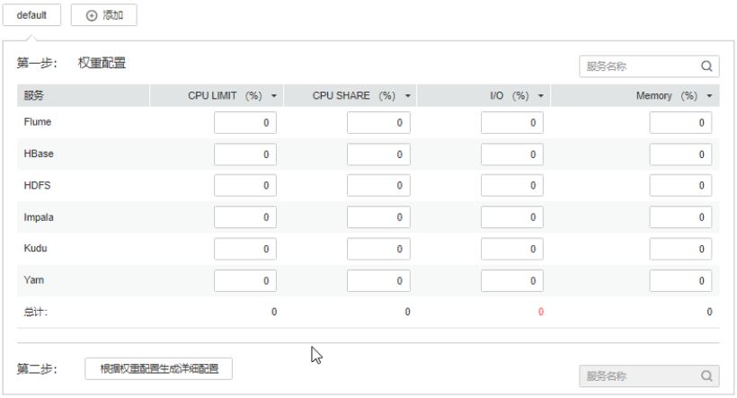
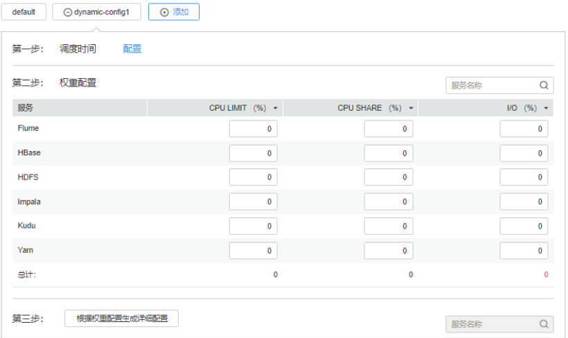

# 配置集群静态资源

## 操作场景

当需要控制集群服务可以使用节点资源的情况，或者控制集群服务在不同时间段节点可用配额的CPU与I/O资源时，管理员可以在FusionInsight Manager调整资源基数，并自定义资源配置组。

## 对系统的影响

-   配置静态服务池后，受影响的服务的“配置状态“将显示为“配置过期“，需要重启服务，重启期间服务不可用。
-   配置静态服务池后，各服务及角色实例使用的最大资源将不能超过限制。

## 操作步骤

**修改资源调整基数**

1.  在FusionInsight Manager界面，选择“集群  \>  _待操作集群的名称_  \> 静态服务池“。
2.  单击右上角“配置”，进入静态资源池配置向导。
3.  在“系统资源调整基数”分别修改参数“CPU（%）”和“Memory（%）”。

    修改“系统资源调整基数”将限制服务能够使用节点的最大物理CPU和内存资源百分比。如果多个服务部署在同一节点，则所有服务使用的最大物理资源百分比不能超过此参数值。

4.  单击“下一步”。

    需要重新修改参数，可单击“上一步”返回。

**修改资源池默认“default”配置组**

1.  单击“default”，在“权重配置”表格中各服务对应的“CPU LIMIT\(%\)”、“CPU SHARE\(%\)”、“I/O\(%\)”和“Memory\(%\)”填写各服务的资源使用百分比数量。

    **图 1**  权重配置  
    

    > **说明：** 
    >-   所有服务使用的“CPU LIMIT\(%\)”和 “CPU SHARE\(%\)”资源配置总和可以大于100%。
    >-   所有服务使用的“I/O\(%\)”资源配置总和可以大于100%，不能为0。
    >-   所有服务使用的“Memory\(%\)”资源配置总和可以小于或等于100%，也可以大于100%。
    >-   “Memory\(%\)”不支持动态生效，仅在“default”配置组中可以修改。
    >-   “CPU LIMIT\(%\)”用于配置服务可使用的CPU核数与节点可分配的CPU核数占比。
    >-   “CPU SHARE\(%\)”用于配置服务在与其他服务使用同一个CPU核的时间占比，即多个服务在使用同一个CPU核发生争抢时的时间占比。

2.  单击“根据权重配置生成详细配置”，FusionInsight Manager将根据集群硬件资源与分配情况，生成资源池实际参数配置值。
3.  单击“确定“。

    在弹出窗口单击“确定“，确认保存配置。

**添加自定义资源配置组**

1.  是否需要在不同时间段自动调整资源配置？
    -   是，执行[9](#zh-cn_topic_0263899377_li1535819244375)。
    -   否，只需要使用“default”在所有时间段生效，任务结束。

2.  单击“配置”，修改“系统资源调整基数”，然后单击“下一步”。
3.  单击“添加”增加新的资源配置组。

    **图 2**  增加新的资源配置组  
    

4.  在“第一步：调度时间”，单击“配置”显示时间策略配置页面。

    根据业务需要修改以下参数，并单击“确定”保存：

    -   “重复”：勾选时表示此资源配置组按调度周期重复运行。不勾选时请设置一个资源配置组应用的日期与时间。
    -   “重复策略”：支持“每天”、“每周”和“每月”。仅在“重复”模式中生效。
    -   “在”：表示资源配置组应用的开始与结束时间。请设置一个唯一的时间区间，如果与已有配置组的时间区间有重叠，则无法保存。

    > **说明：** 
    >-   “default”配置组会在所有未定义的时间段内生效。
    >-   新增加的配置组属于动态生效的配置项集合，在配置组应用的时间区间内可直接生效。
    >-   新增加的配置组可以被删除。最多增加4个动态生效的配置组。
    >-   选择任一种“重复策略”，如果结束时间小于开始时间，默认标识为第二天的结束时间。例如“22:00”到“6:00”表示调度时间为当天22点到第二天6点。
    >-   若多个配置组的“重复策略”类型不相同，则时间区间可以重叠，且生效的策略优先级从低到高的顺序为“每天”、“每周”、“每月”。例如，有“每月”与“每天”的调度配置组，时间区间分别为4:00到7:00，6:00到8:00，此时以每月的配置组为准。
    >-   若多个配置组的“重复策略”类型相同，当日期不相同时，则时间区间可以重叠。例如，有两个“每周”的调度配置组，可以分别指定时间区间为周一和周三的4:00到7:00。

5.  在“第二步：权重配置”修改各服务资源配置。
6.  单击“根据权重配置生成详细配置”，FusionInsight Manager将根据集群硬件资源与分配情况，生成资源池实际参数配置值。
7.  单击“确定“。

    在弹出窗口单击“确定“，确认保存配置。

