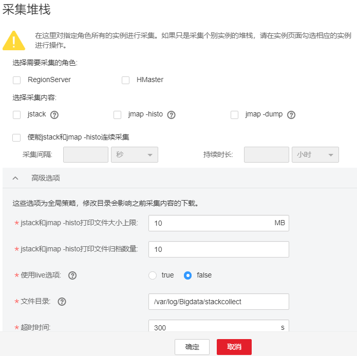
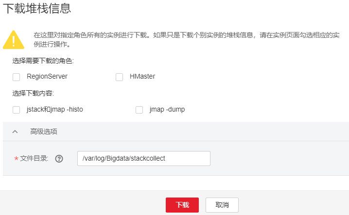
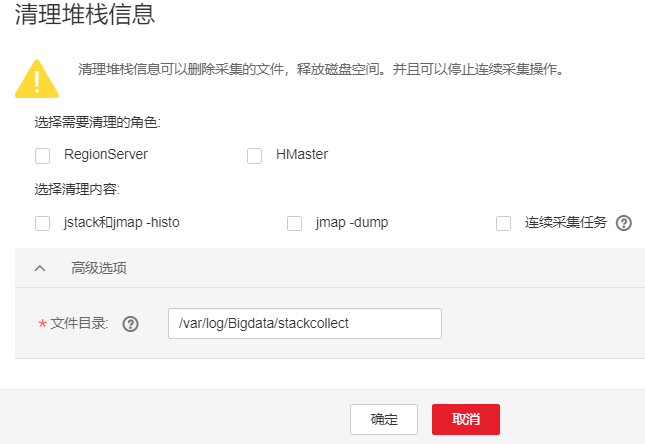

# 采集堆栈信息

## 操作场景

为了满足实际业务的需求，管理员可以在FusionInsight Manager中采集指定角色或实例的堆栈信息，保存到本地目录，并支持下载。采集内容包括：

1.  jstack栈信息。
2.  jmap -histo堆统计信息。
3.  jmap -dump堆信息快照。
4.  对于jstack和jmap-histo信息，支持连续采集以便对比。

## 操作步骤

**采集堆栈**

1.  登录FusionInsight Manager。
2.  选择“集群 \>  _待操作集群_的_名称_   \> 服务 \>  _待收集服务的名称_”。
3.  选择“更多 \> 采集堆栈”。

    > **说明：** 
    >-   采集多个实例的堆栈信息：进入实例列表，勾选要采集的实例名称，选择“更多 \> 采集堆栈”。
    >-   采集单个实例的堆栈信息：单击要采集的实例，选择“更多 \> 采集堆栈”。

4.  根据界面提示，在弹框中选择需要采集的角色，采集内容，配置高级选项（若无特殊需求，保持默认配置即可），单击“确定”。

    **图 1**  采集堆栈  
    

5.  采集成功后，单击“下载”。

**下载堆栈信息**

1.  选择“集群 \>  _待操作集群_的_名称_   \> 服务 \>  _待操作服务的名称_”。选择右上角“更多 \> 下载堆栈信息”。
2.  选择需要下载的角色和内容，单击“下载”，可直接下载相关堆栈信息到本地。

    **图 2**  下载堆栈信息  
    

**清理堆栈信息**

1.  选择“集群 \>  _待操作集群_的_名称_   \> 服务 \>  _待操作服务的名称_”。
2.  选择右上角“更多 \> 清理堆栈信息”。
3.  选择需要清理的角色和内容，并配置“文件目录”。单击“确定”执行清理操作。

    **图 3**  清理堆栈信息  
    

