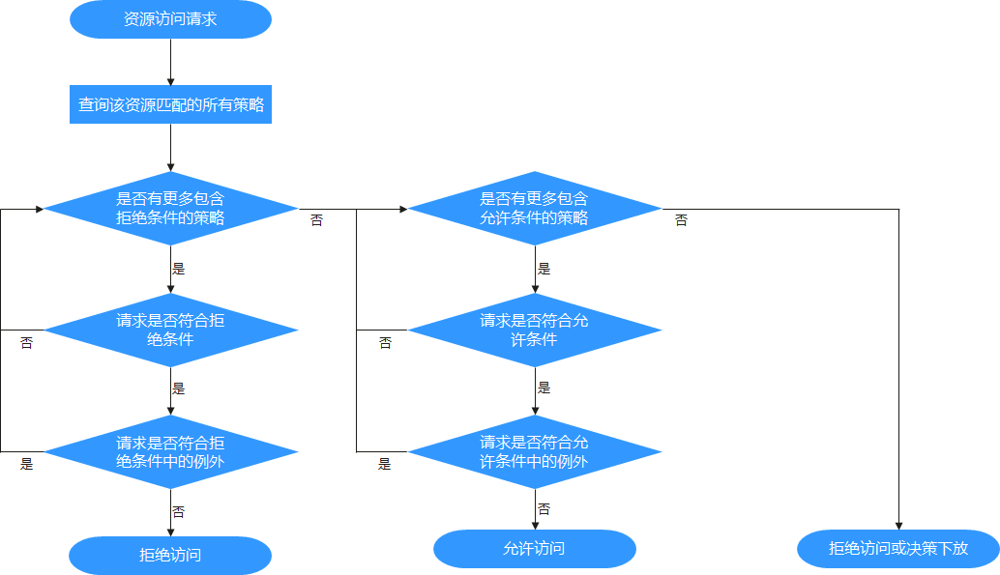

# 鉴权策略

## 安全模式

大数据平台用户完成身份认证后，系统还需要根据实际权限管理配置，选择是否对用户进行鉴权，确保系统用户拥有资源的有限或全部权限。如果系统用户权限不足，需要由系统管理员为用户授予各个组件对应的权限后，才能访问资源。安全模式或者普通模式集群均提供鉴权能力，组件的具体权限项在两种模式中相同。

新安装的安全模式集群默认即安装了Ranger服务并启用了Ranger鉴权，用户可以通过组件的权限插件对组件资源的访问设置细粒度的安全访问策略。若不需使用Ranger进行鉴权，管理员可在服务页面手动停用Ranger鉴权，停用Ranger鉴权后，访问组件资源的时系统将继续基于FusionInsight Manager的角色模型进行权限控制。

安全模式集群中，支持使用Ranger鉴权的组件包括：HDFS、Yarn、Kafka、Hive、HBase、Storm、Spark2x、Impala。

从历史版本升级的集群，用户访问组件资源时默认不使用Ranger鉴权，管理员可在安装了Ranger服务后手动启用Ranger鉴权。

安全版本的集群所有组件默认统一对及访问进行鉴权，不支持关闭鉴权功能。

## 普通模式

普通模式的集群不同组件使用各自原生开源的鉴权行为，详细鉴权机制如[表1](#zh-cn_topic_0263899265_ta45bf66853314ecc850b8e6d38b236e9)所示。

在安装了Ranger服务的普通模式集群中，Ranger可以支持基于OS用户进行组件资源的权限控制，支持启用Ranger鉴权的组件包括：HBase、HDFS、Hive、Spark2x、Yarn。

**表 1**  普通模式组件鉴权一览表

<table><thead align="left"><tr id="zh-cn_topic_0263899265_zh-cn_topic_0046736678_row5380904"><th class="cellrowborder" valign="top" width="25.252525252525253%" id="mcps1.2.4.1.1">
服务

</th>
<th class="cellrowborder" valign="top" width="32.32323232323232%" id="mcps1.2.4.1.2">
是否鉴权

</th>
<th class="cellrowborder" valign="top" width="42.42424242424242%" id="mcps1.2.4.1.3">
是否支持开关鉴权

</th>
</tr>
</thead>
<tbody><tr id="zh-cn_topic_0263899265_row1869819183294"><td class="cellrowborder" valign="top" width="25.252525252525253%" headers="mcps1.2.4.1.1 ">
ClickHouse

</td>
<td class="cellrowborder" valign="top" width="32.32323232323232%" headers="mcps1.2.4.1.2 ">
鉴权

</td>
<td class="cellrowborder" valign="top" width="42.42424242424242%" headers="mcps1.2.4.1.3 ">
不支持修改

</td>
</tr>
<tr id="zh-cn_topic_0263899265_zh-cn_topic_0046736678_row6707649"><td class="cellrowborder" valign="top" width="25.252525252525253%" headers="mcps1.2.4.1.1 ">
Flume

</td>
<td class="cellrowborder" valign="top" width="32.32323232323232%" headers="mcps1.2.4.1.2 ">
无鉴权

</td>
<td class="cellrowborder" valign="top" width="42.42424242424242%" headers="mcps1.2.4.1.3 ">
不支持修改

</td>
</tr>
<tr id="zh-cn_topic_0263899265_zh-cn_topic_0046736678_row65119131"><td class="cellrowborder" valign="top" width="25.252525252525253%" headers="mcps1.2.4.1.1 ">
HBase

</td>
<td class="cellrowborder" valign="top" width="32.32323232323232%" headers="mcps1.2.4.1.2 ">
无鉴权

</td>
<td class="cellrowborder" valign="top" width="42.42424242424242%" headers="mcps1.2.4.1.3 ">
支持修改

</td>
</tr>
<tr id="zh-cn_topic_0263899265_zh-cn_topic_0046736678_row14859795"><td class="cellrowborder" valign="top" width="25.252525252525253%" headers="mcps1.2.4.1.1 ">
HDFS

</td>
<td class="cellrowborder" valign="top" width="32.32323232323232%" headers="mcps1.2.4.1.2 ">
鉴权

</td>
<td class="cellrowborder" valign="top" width="42.42424242424242%" headers="mcps1.2.4.1.3 ">
支持修改

</td>
</tr>
<tr id="zh-cn_topic_0263899265_zh-cn_topic_0046736678_row14944322"><td class="cellrowborder" valign="top" width="25.252525252525253%" headers="mcps1.2.4.1.1 ">
Hive

</td>
<td class="cellrowborder" valign="top" width="32.32323232323232%" headers="mcps1.2.4.1.2 ">
无鉴权

</td>
<td class="cellrowborder" valign="top" width="42.42424242424242%" headers="mcps1.2.4.1.3 ">
不支持修改

</td>
</tr>
<tr id="zh-cn_topic_0263899265_zh-cn_topic_0046736678_row42887128"><td class="cellrowborder" valign="top" width="25.252525252525253%" headers="mcps1.2.4.1.1 ">
Hue

</td>
<td class="cellrowborder" valign="top" width="32.32323232323232%" headers="mcps1.2.4.1.2 ">
无鉴权

</td>
<td class="cellrowborder" valign="top" width="42.42424242424242%" headers="mcps1.2.4.1.3 ">
不支持修改

</td>
</tr>
<tr id="zh-cn_topic_0263899265_zh-cn_topic_0046736678_row35717517"><td class="cellrowborder" valign="top" width="25.252525252525253%" headers="mcps1.2.4.1.1 ">
Kafka

</td>
<td class="cellrowborder" valign="top" width="32.32323232323232%" headers="mcps1.2.4.1.2 ">
无鉴权

</td>
<td class="cellrowborder" valign="top" width="42.42424242424242%" headers="mcps1.2.4.1.3 ">
不支持修改

</td>
</tr>
<tr id="zh-cn_topic_0263899265_zh-cn_topic_0046736678_row32218335"><td class="cellrowborder" valign="top" width="25.252525252525253%" headers="mcps1.2.4.1.1 ">
Loader

</td>
<td class="cellrowborder" valign="top" width="32.32323232323232%" headers="mcps1.2.4.1.2 ">
无鉴权

</td>
<td class="cellrowborder" valign="top" width="42.42424242424242%" headers="mcps1.2.4.1.3 ">
不支持修改

</td>
</tr>
<tr id="zh-cn_topic_0263899265_zh-cn_topic_0046736678_row32836053"><td class="cellrowborder" valign="top" width="25.252525252525253%" headers="mcps1.2.4.1.1 ">
Mapreduce

</td>
<td class="cellrowborder" valign="top" width="32.32323232323232%" headers="mcps1.2.4.1.2 ">
无鉴权

</td>
<td class="cellrowborder" valign="top" width="42.42424242424242%" headers="mcps1.2.4.1.3 ">
不支持修改

</td>
</tr>
<tr id="zh-cn_topic_0263899265_zh-cn_topic_0046736678_row5583857"><td class="cellrowborder" valign="top" width="25.252525252525253%" headers="mcps1.2.4.1.1 ">
Oozie

</td>
<td class="cellrowborder" valign="top" width="32.32323232323232%" headers="mcps1.2.4.1.2 ">
鉴权

</td>
<td class="cellrowborder" valign="top" width="42.42424242424242%" headers="mcps1.2.4.1.3 ">
不支持修改

</td>
</tr>
<tr id="zh-cn_topic_0263899265_zh-cn_topic_0046736678_row13517702"><td class="cellrowborder" valign="top" width="25.252525252525253%" headers="mcps1.2.4.1.1 ">
Spark2x

</td>
<td class="cellrowborder" valign="top" width="32.32323232323232%" headers="mcps1.2.4.1.2 ">
无鉴权

</td>
<td class="cellrowborder" valign="top" width="42.42424242424242%" headers="mcps1.2.4.1.3 ">
不支持修改

</td>
</tr>
<tr id="zh-cn_topic_0263899265_zh-cn_topic_0046736678_row60968157"><td class="cellrowborder" valign="top" width="25.252525252525253%" headers="mcps1.2.4.1.1 ">
Storm

</td>
<td class="cellrowborder" valign="top" width="32.32323232323232%" headers="mcps1.2.4.1.2 ">
无鉴权

</td>
<td class="cellrowborder" valign="top" width="42.42424242424242%" headers="mcps1.2.4.1.3 ">
不支持修改

</td>
</tr>
<tr id="zh-cn_topic_0263899265_zh-cn_topic_0046736678_row57123120"><td class="cellrowborder" valign="top" width="25.252525252525253%" headers="mcps1.2.4.1.1 ">
Yarn

</td>
<td class="cellrowborder" valign="top" width="32.32323232323232%" headers="mcps1.2.4.1.2 ">
无鉴权

</td>
<td class="cellrowborder" valign="top" width="42.42424242424242%" headers="mcps1.2.4.1.3 ">
支持修改

</td>
</tr>
<tr id="zh-cn_topic_0263899265_zh-cn_topic_0046736678_row10983950"><td class="cellrowborder" valign="top" width="25.252525252525253%" headers="mcps1.2.4.1.1 ">
ZooKeeper

</td>
<td class="cellrowborder" valign="top" width="32.32323232323232%" headers="mcps1.2.4.1.2 ">
鉴权

</td>
<td class="cellrowborder" valign="top" width="42.42424242424242%" headers="mcps1.2.4.1.3 ">
支持修改

</td>
</tr>
</tbody>
</table>

## Ranger权限策略条件判断优先级

配置资源的权限策略时，可配置针对该资源的允许条件（Allow Conditions）、允许例外条件（Exclude from Allow Conditions）、拒绝条件（Deny Conditions）以及拒绝例外条件（Exclude from Deny Conditions），以满足不同场景下的例外需求。

不同条件的优先级由高到低为：拒绝例外条件 \> 拒绝条件 \> 允许例外条件 \> 允许条件。

系统判断流程可参考下图所示，如果组件资源请求未匹配到Ranger中的权限策略，系统默认将拒绝访问。但是对于HDFS和Yarn，系统会将决策下放给组件自身的访问控制层继续进行判断。

例如要将一个文件夹FileA的读写权限授权给用户组groupA，但是该用户组内某个用户UserA除外，这时可以增加一个允许条件及一个例外条件即可实现。

