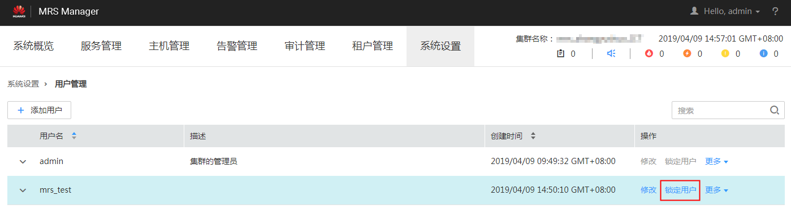

# 锁定用户

该任务指导管理员用户将MRS集群中的用户锁定。用户被锁定后，不能在Manager重新登录或在集群中重新进行安全认证。开启Kerberos认证的集群或开启弹性公网IP功能的普通集群支持该操作。

可通过以下两种方式锁定用户，锁定后的用户需要管理员手动解锁或者等待锁定时间结束才能恢复使用：

-   自动锁定：通过设置密码策略中的“允许输入错误次数”，将超过登录失败次数的用户自动锁定。具体操作请参见[修改密码策略](修改密码策略.md)。
-   手动锁定：由管理员通过手动的方式将用户锁定。

> **说明：** 
>该章节操作仅适用于**MRS 3.x**之前版本集群。
>**MRS 3.x**及之后版本集群请参考[锁定用户](锁定用户-103.md)章节。

以下将具体介绍手动锁定。不支持锁定“机机”用户。

## 操作步骤

1.  访问MRS Manager，详细操作请参见[访问Manager](访问Manager-2.md)。
2.  在MRS Manager，单击“系统设置”。
3.  在“权限配置”区域，单击“用户管理”。

    **图 1**  用户管理  
    

4.  在要锁定用户所在行，单击“锁定用户“，锁定用户。

    **图 2**  锁定用户  
    

5.  在弹出的提示窗口，单击“确定”完成锁定操作。

