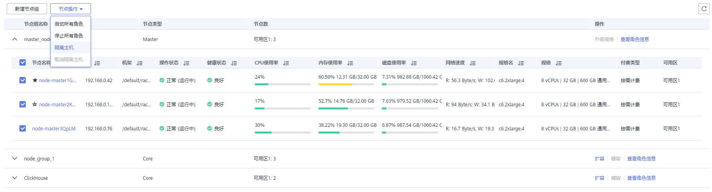

# 隔离主机

## 操作场景

用户发现某个主机出现异常或故障，无法提供服务或影响集群整体性能时，可以临时将主机从集群可用节点排除，使客户端访问其他可用的正常节点。在为集群安装补丁的场景中，也支持排除指定节点不安装补丁。

该任务指导用户在MRS上根据实际业务或运维规划手工将主机隔离。隔离主机仅支持隔离非管理节点。

## 对系统的影响

-   主机隔离后该主机上的所有角色实例将被停止，且不能对主机及主机上的所有实例进行启动、停止和配置等操作。
-   主机隔离后无法统计并显示该主机硬件和主机上实例的监控状态及指标数据。

## 前提条件

已完成IAM用户同步（在集群详情页的“概览”页签，单击“IAM用户同步“右侧的“同步”进行IAM用户同步）。

**图 1**  IAM用户同步（以MRS 1.9.2版本为例）  

## 操作步骤

1.  在集群详情页，单击“节点管理”。
2.  展开节点组信息，勾选待隔离主机前的复选框。
3.  选择“节点操作 \> 隔离主机”。

    

4.  确认待隔离主机信息并单击“确定”。

    界面提示“操作成功。”，单击“完成”，主机成功隔离，“操作状态”显示为“已隔离”

    > **说明：** 
    >已隔离的主机，可以取消隔离重新加入集群，请参见[取消隔离主机](取消隔离主机.md)。

