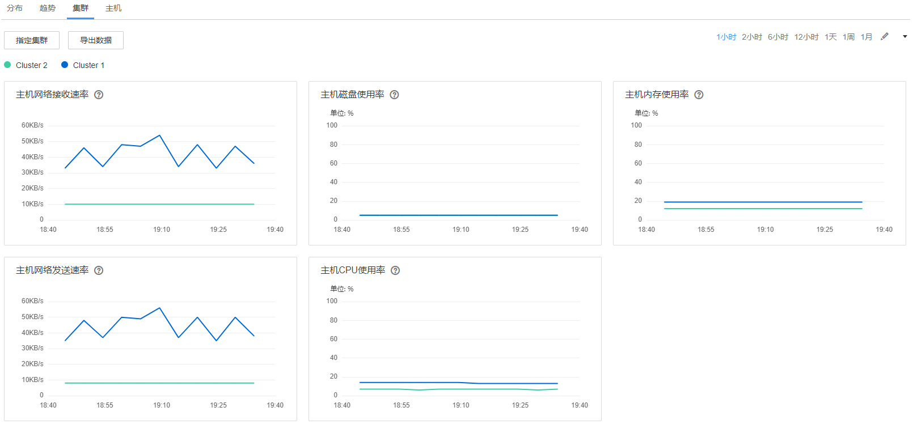

# 集群

选择“主机 \> 资源概况 \> 集群”，可同时查看FusionInsight Manager内各集群的资源监控页面，如[图1](#zh-cn_topic_0263899663_fig832355103111)所示。

系统默认显示1小时的监控数据。用户可单击自定义时间区间，缺省时间区间包括：1小时、2小时、6小时、12小时、1天、1周、1月。

**图 1**  集群资源概况  

-   单击“指定集群“，可定制需要显示的集群。
-   单击，选择“定制”，可以自定义需要在页面上显示的指标项，详细指标项参考[分布](分布.md#admin_guide_000064)中[表1](分布.md#zh-cn_topic_0263899231_table1190415121488)。
-   选择“导出数据”，可以导出各个集群在所有选中的指标项下，选中时间范围内的指标值。

