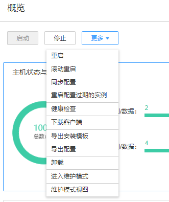

# 集群管理概述

## 总览

登录FusionInsight Manager，选择“集群 \>  _待操作集群的名称_  \> 概览”可以查看当前集群的主要状态信息。

在“概览”页面上可对当前集群进行基本管理操作，如启动、停止、滚动重启、同步配置等，具体如[表1](#zh-cn_topic_0263899522_table17943743105914)所示。

**图 1**  概览  

**表 1**  维护管理功能

<table><thead align="left"><tr id="zh-cn_topic_0263899522_row294464319592"><th class="cellrowborder" valign="top" width="35%" id="mcps1.2.3.1.1">
操作入口

</th>
<th class="cellrowborder" valign="top" width="65%" id="mcps1.2.3.1.2">
说明

</th>
</tr>
</thead>
<tbody><tr id="zh-cn_topic_0263899522_row4511952133818"><td class="cellrowborder" valign="top" width="35%" headers="mcps1.2.3.1.1 ">
“启动”

</td>
<td class="cellrowborder" valign="top" width="65%" headers="mcps1.2.3.1.2 ">
将集群中所有服务启动。

</td>
</tr>
<tr id="zh-cn_topic_0263899522_row7873145384011"><td class="cellrowborder" valign="top" width="35%" headers="mcps1.2.3.1.1 ">
“停止”

</td>
<td class="cellrowborder" valign="top" width="65%" headers="mcps1.2.3.1.2 ">
将集群中所有服务停止。

</td>
</tr>
<tr id="zh-cn_topic_0263899522_row13559154104113"><td class="cellrowborder" valign="top" width="35%" headers="mcps1.2.3.1.1 ">
“更多 &gt; 重启”

</td>
<td class="cellrowborder" valign="top" width="65%" headers="mcps1.2.3.1.2 ">
将集群中所有服务重启。

</td>
</tr>
<tr id="zh-cn_topic_0263899522_row11377930205112"><td class="cellrowborder" valign="top" width="35%" headers="mcps1.2.3.1.1 ">
“更多 &gt; 滚动重启”

</td>
<td class="cellrowborder" valign="top" width="65%" headers="mcps1.2.3.1.2 ">
为集群中所有服务提供不中断业务的重启操作，具体可参考<a href="滚动重启集群.md#admin_guide_000012">滚动重启集群</a>。

</td>
</tr>
<tr id="zh-cn_topic_0263899522_row9939434205111"><td class="cellrowborder" valign="top" width="35%" headers="mcps1.2.3.1.1 ">
“更多 &gt; 同步配置”

</td>
<td class="cellrowborder" valign="top" width="65%" headers="mcps1.2.3.1.2 ">
为集群中所有服务启用新的配置参数。

</td>
</tr>
<tr id="zh-cn_topic_0263899522_row798184820301"><td class="cellrowborder" valign="top" width="35%" headers="mcps1.2.3.1.1 ">
“更多 &gt; 重启配置过期的实例”

</td>
<td class="cellrowborder" valign="top" width="65%" headers="mcps1.2.3.1.2 ">
为集群中所有服务重启配置过期的实例，具体可参考<a href="管理配置过期.md#admin_guide_000013">管理配置过期</a>。

</td>
</tr>
<tr id="zh-cn_topic_0263899522_row49441743155917"><td class="cellrowborder" valign="top" width="35%" headers="mcps1.2.3.1.1 ">
“更多 &gt; 健康检查”

</td>
<td class="cellrowborder" valign="top" width="65%" headers="mcps1.2.3.1.2 ">
为OMS、集群所有服务和所有节点进行健康检查，健康检查可以包含三方面检查项：各检查对象的运行状态、相关的告警和自定义的监控指标，检查结果并不能等同于界面上显示的“运行状态”。

健康检查的结果可直接在检查列表左上角单击“导出报告”，选择导出结果。如果发现问题，可以单击“查看帮助”。

</td>
</tr>
<tr id="zh-cn_topic_0263899522_row13546950125114"><td class="cellrowborder" valign="top" width="35%" headers="mcps1.2.3.1.1 ">
“ 更多 &gt; 下载客户端”

</td>
<td class="cellrowborder" valign="top" width="65%" headers="mcps1.2.3.1.2 ">
为用户下载默认的客户端，具体可参考<a href="下载客户端.md#admin_guide_000014">下载客户端</a>。

</td>
</tr>
<tr id="zh-cn_topic_0263899522_row694484319590"><td class="cellrowborder" valign="top" width="35%" headers="mcps1.2.3.1.1 ">
“ 更多 &gt; 导出安装模板”

</td>
<td class="cellrowborder" valign="top" width="65%" headers="mcps1.2.3.1.2 ">
将集群所有安装配置批量导出，例如集群认证模式、节点信息、服务配置等，可用于相同环境下集群重新安装的场景。

</td>
</tr>
<tr id="zh-cn_topic_0263899522_row8944134317599"><td class="cellrowborder" valign="top" width="35%" headers="mcps1.2.3.1.1 ">
“更多 &gt; 导出配置”

</td>
<td class="cellrowborder" valign="top" width="65%" headers="mcps1.2.3.1.2 ">
将集群所有服务的配置批量导出。

</td>
</tr>
<tr id="zh-cn_topic_0263899522_row47391617264"><td class="cellrowborder" valign="top" width="35%" headers="mcps1.2.3.1.1 ">
“更多 &gt; 进入维护模式/退出维护模式”

</td>
<td class="cellrowborder" valign="top" width="65%" headers="mcps1.2.3.1.2 ">
配置集群进入/退出维护模式。

</td>
</tr>
<tr id="zh-cn_topic_0263899522_row1474018177613"><td class="cellrowborder" valign="top" width="35%" headers="mcps1.2.3.1.1 ">
“更多 &gt; 维护模式视图”

</td>
<td class="cellrowborder" valign="top" width="65%" headers="mcps1.2.3.1.2 ">
查看集群进入维护状态的服务或主机。

</td>
</tr>
</tbody>
</table>

